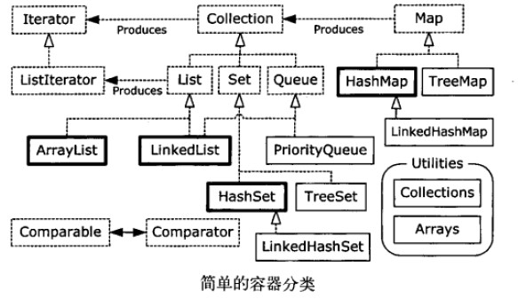

# 持有对象

## 容器基础



- 尽管list所要求的方法都在Collection中，但list的方法与Collection存在着明显的不同
- 除了TreeSet之外，所有的Set拥有与Collection一样的接口
- 在Queue接口中的方法是独立的，在创建具有Queue功能的实现时，不要使用Collection方法
- Map与Collection唯一的重叠在于，Map可以使用entrySet()和values()方法来产生Collection
- 标记接口java.Util.RandomAccess附在了ArrayList上，而没有附着至LinkedList上，这为想要根据所使用的特定的List而动修改其行为的算法提供了信息

## Collection

- list必须按照 插入的顺序保存元素
- set不能有重复的元素
- queue按照排队顺序来确定对象产生的顺序
- 先构造一个空的collection,然后调用，collection.addAll()，或者Collections.addAll(),比以一个collection当作参数构造collection速度要快

## Arrays.asList()

- 产生一个对应对象的list
- 基底层表示仍然是数组，因此不能调整尺寸，在其上调用add(),remove(）方法会出错

## List

- ArrayList, LinkedList
- ArrayList,长于随机访问元素，在中间插入和移除元素比较慢
- LinkedList,在中间插入和删除元素代价较低，提供了优化的顺序访问，随机访问方面相对比较慢
- LinkedList除了实现基本的List接口，还实现了Queue队列接口，因而可以将其用作栈，队列，双端队列

## Set

- HashSet, TreeSet, LinkedHashSet
- HashSet使用散列函数，优化了查询速度
- TreeSet将元素存储在红-黑树数据结构中，它按照元素的比较结果的升序保存对象
- LinkedHashSet，因为查询速度的原因也使用了散列，但是看起来使用了链表来维护元素的插入顺序

## 迭代器

- 使用容器，如果想要代码与容器的确切类型无关，就应当使用迭代器
- Java中的迭代器，只能单向移动
- ListIterator是一个更加强大的Iterator子类型，只能用于各种list的访问，但是它可以支持双向移动
- foreach语法可以用于任何实现了Iterable接口的类，所以可以用于任何的Collection类
- foreach语法也可以用于数组，但是数组不是Iteraable
- 实现一个Iterable类，支持 foreach语法， 能够支持向前向后的移动，一种方法是用适配器模式，另外一种方法是专门提供一个能够产生Iterable对象的方法

```java
import java.util.*;
class ReversibleArrayList<T> extends ArrayList<T> {
    ReversibleArrayList(Collection<T> c) {
        super(c);
    }
    Iterable<T> reversed() {
        return new Iterable<T>() {
            public Iterator<T> iterator() {
                return new Iterator<T>() {
                    int current = size() - 1;
                    public boolean hasNext() {
                        return current > -1;
                    }
                    public T next() {
                        return get(current--);
                    }
                    public void remove() {
                        throw new UnsupportedOperationException();
                    }
                };
            }
        };
    }
}
public class AdapterMethodIdiom {
    public static void main(String[] args) {
        ReversibleArrayList<String> ral = new ReversibleArrayList<String>(
                        Arrays.asList("To be or not to be".split(" ")));
        // Grabs the ordinary iterator via iterator():
        for (String s : ral)
            System.out.print(s + " ");
        System.out.println();
        // Hand it the Iterable of your choice
        for (String s : ral.reversed())
            System.out.print(s + " ");
    }
}
```