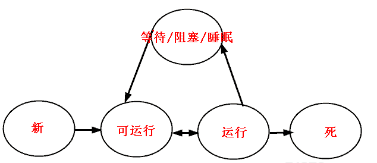

# 多线程

- 进程是运行在它自己的地址空间内的自包容程序
- 一个线程就是在进程中的一个顺序控制流

## 线程的状态

- 线程状态简图



- **新状态**：线程对象已经创建，还没有在其上调用start()方法。

- **可运行状态**：当线程有资格运行，但调度程序还没有把它选定为运行线程时线程所处的状态。当start() 方法调用时，线程首先进入可运行状态。在线程运行之后或者从阻塞、等待或睡眠状态回来后，也返回到可 运行状态。

- **运行状态**：线程调度程序从可运行池中选择一个线程作为当前线程时线程所处的状态。这也是线程进入运行状态的唯一一种方式。
 等待/阻塞/睡眠状态：这是线程有资格运行时它所处的状态。实际上这个三状态组合为一种，其共同点是：线程仍旧是活的，但是当前没有条件运行。换句话说，它是可运行的，但是如果某件事件出现，他可能返回到可运行状态。

- **死亡态**：当线程的run()方法完成时就认为它死去。这个线程对象也许是活的，但是，它已经不是一个单独执行的线程。线程一旦死亡，就不能复生.如果在一个死去的线程上调用start()方法，会抛出java.lang.IllegalThreadStateException异常。

- **使线程离开运行状态的方法**：
  - 调用Thread.sleep()：使当前线程至少睡眠这个时间（尽管它可能在指定的时间之前被中断）;
  - 调用Thread.yield()：不能保障太多事情，尽管通常它会让当前运行线程回到可运行性状态，使得有相同优先级的线程有机会执行;
  - 调用join()方法：保证当前线程停止执行，直到该线程所加入的线程完成为止。然而，如果它加入的线程没有存活，则当前线程不需要停止;
  - 线程的run()方法完成;
  - 在对象上调用wait()方法（不是在线程上调用）;
  - 线程不能在对象上获得锁定，它正试图运行该对象的方法代码;、
  - 线程调度程序可以决定将当前运行状态移动到可运行状态，以便让另一个线程获得运行机会，而不需要任何理由

## 线程sleep()

- 线程休眠的目的是使线程让出CPU的最简单的做法之一，线程休眠时候，会将CPU资源交给其他线程，以便能轮换执行，当休眠一定时间后，线程会苏醒，进入准备状态等待执行
- 线程休眠不会释放对象的锁
- 两种方法调用是一样的，将当前thread,休眠掉

```java
    try {
        Thread.sleep(7*1000);
    } catch (InterruptedException e) {
        e.printStackTrace();
    }

    try {
        TimeUnit.SECONDS.sleep(7);
    } catch (InterruptedException e) {
        e.printStackTrace();
    }
```

## 线程优先级

- 调度器倾向于让优先级最高的线程先执行，但是并不是意味着低优先权的线程将得不到执行，也就是说优先权不会导致死锁
- 试图操纵线程优先级通常是一种错误
- 优先级是在run()方法中设定的，在构造器中设置它们不会有任何好处，因为Executor此时还没有开始执行任务
- Thread.MAX_PRIORITY, NORMAL_PRIORITY,MIN_PRIORITY

## 线程yield()

- 暗示cpu，工作差不多了，可以让别的线程使用cpu了
- 仅是一个暗示作用，没有任何机制可以保证它会被采纳
- 当调用yield（)时，也是在建议相同有限级的其它线程可以运行
- 调用Thread.yield(),当前线程从运行状态变为可运行状态

## 线程 join()

- a线程的run中调用b.join()，a会被挂起，直到线程b结束才恢复（也就是b.isAlive（）为假）
- 在一个线程上调用interrupt()时，将给该线程一个标志，表明该线程已经被中断，但是如果捕获了这个异常，则这个标志会被清除

## 后台线程

- setDaemon(True)
- 后台线程是提供一种通用服务的线程，并且这种线程并不属于程序中不可或缺的一部分
- 当程序的所有非后台线程结束时，程序也就结束了，并且会杀死所有后台线程
- 只要存在任何非后台线程还在运行，程序就不会张终止
- 任何后台线程创建的线程都是后台线程
- 当关闭最后一个非后台线程时，所有的后台线程都会被立即关闭，可能会导致后台线程的部分代码不会执行，如果是非后台线程，则代码一定会执行
- 非后台的Executor是一种更好的方式，它可以控制所有任务可以同时被关闭

## 异常

- 由于线程的本质特性，不能捕获从线程中逃逸出来的异常
- 使用Thread.UncaughtExceptionHandler
- 还可以在Thread类中设置一个静态域，当线程不存在特有UncaughtExceptionHandler版本的，
 并且也没有线程组专有UncaughtExceptionHandler的时候，就会使用defaultUncaughtExceptionHandler
 Thread.setDefaultUncaughtExceptionHandler(new MyUncaughtExceptionHandler());

```java
class MyUncaughtExceptionHandler implements
Thread.UncaughtExceptionHandler {
  public void uncaughtException(Thread t, Throwable e) {
    System.out.println("caught " + e);
  }
}
class HandlerThreadFactory implements ThreadFactory {
  public Thread newThread(Runnable r) {
    System.out.println(this + " creating new Thread");
    Thread t = new Thread(r);
    System.out.println("created " + t);
    t.setUncaughtExceptionHandler(
      new MyUncaughtExceptionHandler());
    System.out.println(
      "eh = " + t.getUncaughtExceptionHandler());
    return t;
  }
}
 ExecutorService exec = Executors.newCachedThreadPool(
      new HandlerThreadFactory());
```

## 使用Executor管理thread对象

- FixedThreadPool
- CachedThreadPool,通常会创建与所需相同数量的线程，然后在它回收旧线程时停止创建新线程
- SingleThreadExecutor，对于希望在同一个线程中连续运行的任何事物（长期存在的任务，比如长连接）来说，都是很有用的。
- 如果向SingleThreadExecutor中提交了多个任务，这些任务将排队，每个任务都会在下一个任务开始之前运行结束，
 所有的任务将使用相同的线程。因些它会序列化所有提交给它的任务，并会维护它自己的悬挂任务队列。
- SingleThreadExecutor上，由于是在同一线程，经常不需要在共享资源上作同步。

## 从任务中返回值

- Runnable执行独立的任务，但不返回值，如果要返回值，使用Callable
- Callable必须使用EXecutorService.submit()方法调用它
- submit产生Future对象
- 可以用isDone()来检测Future是否完成
- 也可以直接调用get()，但是会阻塞

```java
class Task implements Callable<String> {
  private int id;
  public Task(int id) {
    this.id = id;
  }
  
  public String call(){
    return "result of Task" + id;
  }
}
ExecutorService exec = Executors.newCachedThreadPool();
List<Future<String>> list = new ArrayList<>();
for(int i = 0; i < 10; ++i) {
  list.add(exec.submit(new Task(i)));
}
```

## 解决共享资源兑争

- 对于并发工作，需要某种方式来防止两个任务访问相同的资源，防止这种冲突的方法就是当资源被一个任务使用时，在其上加锁
- java中，要控制对共享资源的访问，首先得把它包装进一个对象，然后把所有要访问这个资源的方法标记为synchronized
 使用并发时，必须将值设为private

## 同步与锁

- 只能同步方法，而不能同步变量和类；
- 每个对象只有一个锁；当提到同步时，应该清楚在什么上同步？也就是说，在哪个对象上同步？
- 不必同步类中所有的方法，类可以同时拥有同步和非同步方法。
- 对于某个对象来说，所有synchronized方法共享一个锁,如果某个任务处于一个对标记为synchronized的方法调用中，
 那么在这个线程从该方法返回之前，其它所有要调用类中任何标记为synchronized方法的线程都会被堵塞
- 如果线程拥有同步和非同步方法，则非同步方法可以被多个线程自由访问而不受锁的限制。
- 线程睡眠时，它所持的任何锁都不会释放。
- 线程可以获得多个锁。比如，在一个对象的同步方法里面调用另外一个对象的同步方法，则获取了两个对象的同步锁。
- 同步损害并发性，应该尽可能缩小同步范围。同步不但可以同步整个方法，还可以同步方法中一部分代码块。
 在使用同步代码块时候，应该指定在哪个对象上同步，也就是说要获取哪个对象的锁
- 针对每个类，也有一个锁，也就是class对象，所有synchronized static方法可以在类的范围内防止对static数据据的并发访问
- Brian同步原则：如果你正在写一个变量，它可能接下来被另一个线程读取，或者正在读取一个上一次已经被另一个线程写过的变量，那么你必须使用同步，并且，读写线程必须用   相同的监视器锁同步
- 每一个访问临界共享资源的方法都必须同步，否则它们就不会正常工作
- java中可以使用synchronize关键字，也可以使用显示的Lock对象
 编写线程安全的类，需要时刻注意对多个线程竞争访问资源的逻辑和安全做出正确的判断，对“原子”操作做出分析，并保证原子操作期间别的线程无法访问竞争资源

## 线程阻塞

- 调用同一个对象中非静态同步方法的线程将彼此阻塞。如果是不同对象，则每个线程有自己的对象的锁，线程间彼此互不干预。
- 调用同一个类中的静态同步方法的线程将彼此阻塞，它们都是锁定在相同的Class对象上。
- 静态同步方法和非静态同步方法将永远不会彼此阻塞，因为静态方法锁定在Class对象上，非静态方法锁定在该类的对象上。
- 对于同步代码块，要看清楚什么对象已经用于锁定（synchronized后面括号的内容）。在同一个对象上进行同步的线程将彼此阻塞，在不同对象上锁定的线程将永远不会彼此阻塞。

## 原子性与可见性

- 原子操作是不能被线程调度机制中断的操作，一旦操作完成，那么它一定可以在可能发生的“上下文切换“之前执行完毕
- 原子性可以应用于除了long与double之外的所有基本类型之上的简单操作（long,与double因为是64位，因而是先低32位，后高32位操作，可能处于中间状态）
- 一个任务做出的修改，即使在不中断的意义上讲是原子性的，有可能该变后，只是暂时性地存储在本地处理器的缓存中，没有刷新到主存中，造成可能对于其它线程是不可见的
- violatile关键字，确保了应用中的可见性，但是本身却不能保证原子性与互斥性
- 原子类，AtomicInteger, AtomicLong, AtomicReference等

## 临界区

- 希望防止多个线程同时访问方法内部的部分代码而不是防止访问整个方法，通过这种方法分离出来的代码段被称为临界区
- 也就是在方法内部使用synchronized

## 在其它对象上同步

- synchronized必须给定一个在其上进行同步的对象，其中最合理的方式是，使用其方法正在被调用的当前对象，synchronized非静态方法就是这样
- 有时如果要在另一个对象上同步，则必须保证所有相关的作务都是在一个对象上同步
- synchronized(this)与synchronized当前对象内部的一个对象，两者不会因为对另一个方法的调用而互相阻塞

## ThreadLocal

- 防止任务在共享资源上产生冲突的第二次种方式，根除对变量的共享
- ThreadLocal,为使用相同变量的每个不同线程都创建不同的存储


