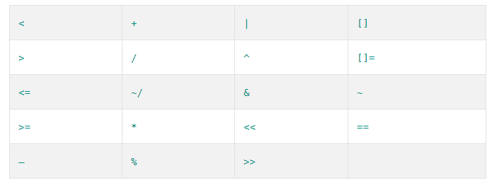

# A Tour of the Dart Language

- [A Tour of the Dart Language](https://www.dartlang.org/guides/language/language-tour)

- [基本概念](#基本概念)
- [变量](#变量)
- [final 与 const](#final-与-const)
- [类型](#类型)
    - [string](#string)
    - [map list](#map-list)
    - [Function](#function)
    - [函数参数](#函数参数)
    - [返回值](#返回值)
    - [cascade](#cascade)
    - [匿名函数](#匿名函数)
    - [闭包](#闭包)
- [运算符](#运算符)
    - [其它](#其它)
- [语句](#语句)
    - [循环](#循环)
- [Exceptions](#exceptions)
    - [catch](#catch)
    - [finally](#finally)

## 基本概念

- 一切都是对象，所有继承于Object,int,double也是Object
- **函数支持全局函数，也支持类的成员与静态函数**
- **支持全局变量，也支持类的成员与静态变量**

```Dart
void main() {
  var a = 1;
  printInteger(a);
  printInteger(test);
}

int test = 10;

void printInteger(int number) {
  print("the number is $number");
}
```

- **dart没有public,protected和private,以下滑线开头的标识符对于library是private的**

## 变量

- **dart是强类型语言，如果类型不定，使用dynamic与object**

```Dart
dynamic name = "Bob'
```

- **所有变量没有初始化为null,即使是int,因为int也是对象**

```Dart
int lineCount;
assert(lineCount == null)
```

## final 与 const

- final只能被设置一次值
- **const是编译期间的常量**，const隐式是final的
- **final变量必须在构造函数体开始前初始化，在变量定义的地方，构造函数参数或Initializer list**

```Dart
class TestFinal {
  // 在定义变量的地方初始化
  final int a = -1;
  final int b;
  final int c;
  final int d;
  
  // 用语法糖在构造函数的参数中初始化
  // 在初始化列表中初始化
  TestFinal(this.b, this.c, int d) : d = d;
}

```

## 类型

### string

- 在string中使用变量或表达式的值，$variableName (or ${expression})

```Dart
printInteger(int aNumber) {
  print('The number is $aNumber.'); // Print to console.
}
```

- 多行string,使用三层引号

```Dart
var s1 = '''
You can create
multi-line strings like this one.
''';

var s2 = """This is also a
multi-line string.""";
```

- **raw string,不进行转义,字符串前加上r**

```Dart
var s = r'In a raw string, not even \n gets special treatment.';
```

### map list

```Dart
var list = [1, 2, 3];

// 编译期常量
var constantList = const [1, 2, 3];

var gifts = {
  // Key:    Value
  'first': 'partridge',
  'second': 'turtledoves',
  'fifth': 'golden rings'
};

var gifts = Map();
gifts['first'] = 'partridge';
gifts['second'] = 'turtledoves';
gifts['fifth'] = 'golden rings';
```

#### List

- **List的构造函数中如果指定长度，那么它是定长的，相当于数组，向其中添加元素不能超过初始指定的长度**
- 如果不指定长度，那么相当于ArrayList，会自增长
- **List如果调用length指定长度，那么[0, length)范围内的“空”出来**

```Dart
  List<int> l = new List(2);
  l.add(1);
  l.add(2);
  // 向其中添加3会报错，因为长度初始指定，那么它就是定长的数组
  // l.add(3);

  List<int> a = new List();
  a.length = 2;
  a.add(1);
  a.add(2);
  a.add(3);
  print(a.length);
  print(a);
// 开始指定长度为2，后面又添加3个元素，所以最后length为5
// 5
// [null, null, 1, 2, 3]
```

### Function

- **Dart中function也是对象,也是first-class对象**
- => 等号等价于 { return expr; }， 返回中只能有一个表达式，而不是语句，因而可以是条件表达式

```Dart
bool isNoble(int atomicNumber) => _nobleGases[atomicNumber] != null;
```

### 函数参数

- 函数调用时使用命名参数
- **@required表示必须的参数，import 'package:meta/meta.dart'; 但是参数本身可以为null**
- 用[]来表示可选参数
- 参数用=指定默认值，但默认值必须是编译常量

```Dart
void enableFlags({bool bold, bool hidden}) {...}

// 调用时可选的命名调用
enableFlags(bold: true, hidden: false);

// 必要的参数，可用@required注解
const Scrollbar({Key key, @required Widget child})

// device是可选参数
String say(String from, String msg, [String device]) {
  var result = '$from says $msg';
  if (device != null) {
    result = '$result with a $device';
  }
  return result;
}

// 参数默认值，必须编译常量
void enableFlags({bool bold = false, bool hidden = false}) {...}
enableFlags(bold: true);

// 参数默认值也可以是list,因为编译器常量的原因，所以加上const
void doStuff(
    {List<int> list = const [1, 2, 3],
    Map<String, String> gifts = const {
      'first': 'paper',
      'second': 'cotton',
      'third': 'leather'
    }}) {
  print('list:  $list');
  print('gifts: $gifts');
}
```

### 返回值

- **所有的函数都返回一个值，如果没有指定返回值，那么返回null**
- 如果指定返回void，那么返回值不能与null比较

```Dart
foo() {}

// 如果没有指定返回类型，那么是null
print(foo() == null);
```

### 匿名函数

```Dart
([[Type] param1[, …]]) {
  codeBlock;
};

// 参数用括号括起来，可以带上参数类型，也可以不带
List<String> strList = ['abc', 'def', 'hij'];
  strList.forEach( (String a) {
    print(a);
  });

List<String> strList = ['abc', 'def', 'hij'];
  strList.forEach( (a) {
    print(a);
  });

```

### 闭包

- 支持闭包

```Dart
Function makeAdder(num addBy) {
  return (num i) => addBy + i;
}

void main() {
  // Create a function that adds 2.
  var add2 = makeAdder(2);

  // Create a function that adds 4.
  var add4 = makeAdder(4);

  assert(add2(3) == 5);
  assert(add4(3) == 7);
}
```

- 函数相等性

```Dart
void foo() {} // A top-level function

class A {
  static void bar() {} // A static method
  void baz() {} // An instance method
}

void main() {
  var x;

  // Comparing top-level functions.
  x = foo;
  // true
  print(foo == x);

  // 同一个类的静态方法相等
  x = A.bar;
  // true
  print(A.bar == x);

  // Comparing instance methods.
  var v = A(); // Instance #1 of A
  var w = A(); // Instance #2 of A
  var y = w;
  x = w.baz;

  // 相同对象的成员函数相同
  // true
  print(y.baz == x);

  // 不同对象的成员函数不相等
  // true
  print(v.baz != w.baz);
}
```

## Operators

- **dart支持运算符重载**
- 对于双目运算符，运算符左边的对象决定了使用的是哪一个重载的运算符

```Dart
assert(5 / 2 == 2.5); // Result is a double
assert(5 ~/ 2 == 2); // Result is an int
```

Description              | Operator
-------------------------|---------------------------------------------------------------------------------
unary postfix            | expr++    expr--    ()    []     .      ?.
unary prefix             | -expr    !expr    ~expr    ++expr    --expr
multiplicative           | *    /    %  ~/
additive                 | +    -
shift                    | <<    >>
bitwise AND              | &
bitwise XOR              | ^
bitwise OR               | &#124;
relational and type test | >=    >    <=    <    as    is    is!
equality                 | ==    !=
logical AND              | &&
logical OR               | &#124;&#124;
if null                  | ??
conditional              | expr1 ? expr2 : expr3
cascade                  | ..
assignment               | =    *=    /=    ~/=    %=    +=    -=    <<=    >>=    &=  ^=    &#124;=    ??=

### 算术运算符

- ~/ 除法，返回整数

```Dart
// Result is a double
assert(5 / 2 == 2.5);

// Result is an int
assert(5 ~/ 2 == 2);
```

### type test operators

- as is is!

```Dart
// 先进行类型检测
if (emp is Person) {
    emp.firstName = 'Bob';
}

// 直接进行类型转换，如果emp不是Person，会Exception
(emp as Person).firstName = 'Bob';
```

### 赋值

- = 和 ??=

```Dart
// 无论a是什么，都将value的值赋值给它
a = value;

// 如果b为null,那么将value赋值给它，否则b保持不变
b ??= value;
```

### 条件运算符

- condition ? expr1 : expr2
- expr1 ?? expr2 **如果expr1不为null,返回expr1,否则返回expr2**

```Dart
var visibility = isPublic ? 'public' : 'private';

// 如果name为null，返回Guest,否则返回name
String playerName(String name) => name ?? 'Guest';
```

### cascade

- 对同一个对象，执行多个动作，相当于return this

```Dart
querySelector('#sample_text_id')
    ..text = 'Click me!'
    ..onClick.listen(reverseText);
```

### 其它

- ?. 条件成员操作符

```Dart
// 如果a为null,不做什么，否则调用a的test方法
a?.test()
// a为null,返回null,否则返回a的value成员
a?.value
```

## 语句

### 循环

- 实现了Iterable使用forEach()
- List,Set使用for-in

```Dart
var collection = [0, 1, 2];
for (var x in collection) {
  print(x); // 0 1 2
}
```

## Exceptions

- **Dart可以抛出任何非null的对象，而不仅是Exception**，但一般情况下我们都会抛出实现了Error或Exception的类型对象
- **Dart中抛出的都是unchecked exceptions**,因而方法不一定会指明抛出什么异常，我们也并不要求去捕获这些异常
- 抛出异常是语句，所以在可以在=>中使用

```Dart
void distanceTo(Point other) => throw UnimplementedError();
```

### catch

- on 用来指明类型
- catch用来处理异常对象,**catch可以接受两个参数，第一个参数为异常对象，第二个为StackTrace**
- **再次抛出异常，使用rethrow**

```Dart
try {
  breedMoreLlamas();
} on OutOfLlamasException {
  // A specific exception
  buyMoreLlamas();
} on Exception catch (e) {
  // Anything else that is an exception
  print('Unknown exception: $e');
} catch (e) {
  // No specified type, handles all
  print('Something really unknown: $e');
}

try {
  // ···
} on Exception catch (e) {
  print('Exception details:\n $e');
} catch (e, s) {
  print('Exception details:\n $e');
  print('Stack trace:\n $s');
}

void misbehave() {
  try {
    dynamic foo = true;
    print(foo++); // Runtime error
  } catch (e) {
    print('misbehave() partially handled ${e.runtimeType}.');
    rethrow; // Allow callers to see the exception.
  }
}
```

### finally

- 与java中的finally一样

## Class

- **Dart中的关健字new不是必需的**

### runtimeType

- runtimeType返回运行时类型

```Dart
print('The type of a is ${a.runtimeType}');
```

### 对象初始化

- Dart中所有变量都是对象，**所有未初始化的成员变量都是null**
- **所有成员变量都会生成一个隐式的getter方法，所有非final的成员变量都会生成一个隐式的setter方法**
- **如果在定义成员变量的地方初始化，那么成员变量的初始化早于构造函数与初始化列表**

### 构造函数

- 语法糖：成员变量的初始化
- **构造函数如果函数体为空，可以直接省略{},用;替代**

```Dart
class Point {
  num x, y;

  // Syntactic sugar for setting x and y
  // before the constructor body runs.
  Point(this.x, this.y);
}
```

- **构造函数不会被继承**

#### 命名构造函数

- 因为构造函数不会被继承，所以**如果子类想要调用父类的命名构造函数，那么子类必须自己实现同名的构造函数**

```Dart
class Point {
  num x, y;

  Point(this.x, this.y);

  // Named constructor
  Point.origin() {
    x = 0;
    y = 0;
  }
}
```

#### 初始化列表

- **初始化列表先于构造函数体执行**
- **final对象只能在定义成员变量的地方和初始化列表中初始化**，不能在构造函数中初始化
- 可以在初始化列表中进行值判断

```Dart
Point.fromJson(Map<String, num> json)
    : x = json['x'],
      y = json['y'] {
  print('In Point.fromJson(): ($x, $y)');
}

// final对象的初始化
class Point {
  final num x;
  final num y;
  final num distanceFromOrigin;

  Point(x, y)
      : x = x,
        y = y,
        distanceFromOrigin = sqrt(x * x + y * y);
}

// 值判断
Point.withAssert(this.x, this.y) : assert(x >= 0) {
  print('In Point.withAssert(): ($x, $y)');
}
```

#### 调用父类的构造函数

- 默认构造函数调用顺序：
    - 初始化列表
    - 父类构造函数
    - 自己的构造函数
- 可以手动指定初始化列表与父类构造函数的顺序，但是这两者都是在构造函数体执行前执行的

```Dart
class Person {
  String firstName;

  Person.fromJson(Map data) {
    print('in Person');
  }
}

class Employee extends Person {
  // Person does not have a default constructor;
  // you must call super.fromJson(data).
  Employee.fromJson(Map data) : super.fromJson(data) {
    print('in Employee');
  }
}
```

#### 调用自身

```Dart
class Point {
  num x, y;

  // The main constructor for this class.
  Point(this.x, this.y);

  // Delegates to the main constructor.
  Point.alongXAxis(num x) : this(x, 0);
}
```

#### Constant constructors

- 返回的是一个编译期的常量对象
- **构造方法加上const，并且所有的成员对象都需要为final**

```Dart
class ImmutablePoint {
  static final ImmutablePoint origin =
      const ImmutablePoint(0, 0);

  final num x, y;

  const ImmutablePoint(this.x, this.y);
}
```

- const位置

```Dart
// 假设ImmutablePoint是const constractors
// 常量对象
const pointAndLine = const {
  'point': const [const ImmutablePoint(0, 0)],
  'line': const [const ImmutablePoint(1, 10), const ImmutablePoint(-2, 11)],
};

// 返回的也是常量对象
const pointAndLine = {
  'point': [ImmutablePoint(0, 0)],
  'line': [ImmutablePoint(1, 10), ImmutablePoint(-2, 11)],
};

// 常量对象
var a = const ImmutablePoint(1, 1); // Creates a constant

// 非常量对象
var b = ImmutablePoint(1, 1);
```

#### Factory constructors

- 工厂构造函数，factory
- 主要用于不是每一次都创建新的对象

```Dart
class Logger {
  final String name;
  bool mute = false;

  // _cache is library-private, thanks to
  // the _ in front of its name.
  static final Map<String, Logger> _cache =
      <String, Logger>{};

  factory Logger(String name) {
    if (_cache.containsKey(name)) {
      return _cache[name];
    } else {
      final logger = Logger._internal(name);
      _cache[name] = logger;
      return logger;
    }
  }

  Logger._internal(this.name);

  void log(String msg) {
    if (!mute) print(msg);
  }
}
```

### Methods

#### getters and setters

- **每一个成员变量都有一个隐式的getter,非final的对象都有一个隐式的setter**
- **可以通过实现getter与setter为对象增加额外的属性**

```Dart
class Rectangle {
  num left, top, width, height;

  Rectangle(this.left, this.top, this.width, this.height);

  // Define two calculated properties: right and bottom.
  num get right => left + width;
  set right(num value) => left = value - width;
  num get bottom => top + height;
  set bottom(num value) => top = value - height;
}
```

#### abstract

#### Implicit interfaces

- **Dart中要实现的接口可以是一个具体的类,并且要求重写所有可见的方法**
- **实接一个接口，接口中的可见的隐式的setter与getter也会被要求重写**
- **如果不想实现部分方法，可以重写noSuchMethod方法**

```Dart
class Person {
  // In the interface, but visible only in this library.
  final _name;

  // Not in the interface, since this is a constructor.
  Person(this._name);

  // In the interface.
  String greet(String who) => 'Hello, $who. I am $_name.';

  String _greet(String who) => 'Hello, $who. I am $_name.';
}

// 如果ImplementInterface与Person在一个library中，则要求重写greet,_greet与_name的setter方法(_name的setter因为final不存在)
//  如果ImplementInterface与Person不在一个library中，则只要求重写greet方法，其它的两个方法因为可见性的原因不要求重写
class ImplementInterface implements Person {
  @override
  // TODO: implement _name
  get _name => null;

  @override
  String greet(String who) {
    // TODO: implement greet
    return null;
  }

  @override
  String _greet(String who) {
    // TODO: implement _greet
    return null;
  }
}
```

- 实现多个接口

```Dart
class Point implements Comparable, Location {...}
```

#### Extending a class

- 使用super调用父类方法

#### Overriding members

- @override
- 如果需要缩小一个方法的参数或者变量值，并且是类型安全的，可以使用关键字covariant

```Dart
class Animal {
  void chase(Animal x) { ... }
}

class Mouse extends Animal { ... }

class Cat extends Animal {
  void chase(covariant Mouse x) { ... }
}
```

#### Overridable operators



- != 不需要重载，重载==就可以了

```Dart
class Vector {
  final int x, y;

  Vector(this.x, this.y);

  Vector operator +(Vector v) => Vector(x + v.x, y + v.y);
  Vector operator -(Vector v) => Vector(x - v.x, y - v.y);

  // Operator == and hashCode not shown. For details, see note below.
  // ···
}
```

### Enumerated types

- index()方法返回index,第一个枚举返回0
- 返回所有的枚举 values
- 枚举可以用在switch中

```Dart
enum Color { red, green, blue }
assert(Color.red.index == 0);

List<Color> colors = Color.values;
assert(colors[2] == Color.blue);
```

### mixin

- **可以认为mixin是java中带有成员变量的interface，定义了不同继承体系中可以通用的方法与变量**
- minin的原理与用途：
    - 首先**Dart是单继承**
    - 如果两个类继承的父类不同，但是有相同的功能，可以使用接口来实现
    - 但是接口只有方法签名，没有实现，在两个不同的类中可能要将相同的代码写一遍
    - 如果相同功能的实现也相同，可以将相同功能的代码放到一个mixin中，然后这两个类使用mixin就可以了

- 实现一个mixin
    - 创建一个继承Object的类
    - 不要创建构造函数，只有默认构造函数
    - 除非要将mixin当作普通类使用，否则使用mixin而非class

```Dart
// 首先定义一个mixin
// 里面可以包含代码和成员变量
mixin Musical {
  bool canPlayPiano = false;
  bool canCompose = false;
  bool canConduct = false;

  void entertainMe() {
    if (canPlayPiano) {
      print('Playing piano');
    } else if (canConduct) {
      print('Waving hands');
    } else {
      print('Humming to self');
    }
  }
}

class A {}

class B {}

// C和D继承体系不一样，但是却同时有Musical中的成员变量与方法
class C extends A with Musical {
  
}

class D extends B with Musical {
  
}


void main() {
  C c = new C();
  c.canCompose = true;
  c.entertainMe();
  
  D d = new D();
  d.canPlayPiano = true;
  d.entertainMe();
}
```

- 指定只有某些类可以使用mixin,使用on

```Dart
// 只有Musician可以使用mixin MusicalPerformer
mixin MusicalPerformer on Musician {
  // ···
}
```

### Class variables and methods

#### static

- 静态变量只有当要用的时候，才会初始化

## Generics

### 常见使用

- Using collection literals

```Dart
var names = <String>['Seth', 'Kathy', 'Lars'];
var pages = <String, String>{
  'index.html': 'Homepage',
  'robots.txt': 'Hints for web robots',
  'humans.txt': 'We are people, not machines'
};
```

- 构造函数中

```Dart
var names = List<String>();
names.addAll(['Seth', 'Kathy', 'Lars']);
var nameSet = Set<String>.from(names);
```

### Dart中泛型与java的不同

- **java中的泛型使用擦除实现，而Dart不是的**

```Dart
var names = List<String>();
names.addAll(['Seth', 'Kathy', 'Lars']);
print(names is List<String>); // true

var names = <String>["Seth", "Kathy", "Lars"];
var ids = <int>[1, 2, 3];
// 在java中两者都是list,类型是一样的，但是在Dart中两者的类型是不一样的
print(names.runtimeType == ids.runtimeType);
```

### 泛型中的extends

- 泛型参数中可以指定

```Dart
class Foo<T extends SomeBaseClass> {
  // Implementation goes here...
  String toString() => "Instance of 'Foo<$T>'";
}

class Extender extends SomeBaseClass {...}

var someBaseClassFoo = Foo<SomeBaseClass>();
var extenderFoo = Foo<Extender>();
```

### 泛型方法

- [Using Generic Methods.](https://github.com/dart-lang/sdk/blob/master/pkg/dev_compiler/doc/GENERIC_METHODS.md)
- 与java的不同之处在于，**java中除了static方法，否则不能使用定义类时指定泛型参数之外的泛型参数，但是Dart中是可以的**

```Dart
TestGeneric testGeneric = new TestGeneric<int>();
  testGeneric.test(<String>["a", "b", "c"]);
```

## Libraries and visibility

- Dart中一个每一个app都是一个library
- _开头的成员变量与方法在library中都仅在同一个libary中可见

```Dart
// 指定一个library
library learningdart;

// 系统的以dart开头
import 'dart:html';

// 自己的以package开头的schem

import 'package:test/test.dart';
```
