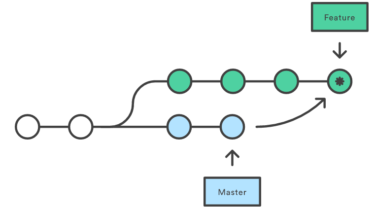

# 分支管理

- 创建一个分支

  ```
  git branch develop
  ```

- 切换到一个分支

  ```
  git checkout develop
  ```

- 创建并切换到一个新的分支

  ```
  git checkout -b new_branch
  ```

- 查看分支,其中不带参数显示本地分支，-a所有的分支，-r远程分支, -v显示分支和分支的最后一次 commit, 列出的分支中，带 ***** 的为当前的分支,要从该清单中筛选出你已经（或尚未）与 当前分支合并的分支，可以用 --merged 和 --no-merged 选项

  ```
  git branch
  git branch -a
  git branch -r
  git branch -v
  git branch --merged
  git branch --no-merged
  ```

- git删除分支,**不能删除当前的分支，必须先切换到另外的一个分支上才行**

  ```
  git branch -d new_branch
  ```

- 分支重命名

  ```
  git branch -m <旧分支名> <新分支名>
  ```

# git merge

- git merge将分支合并，下面命令将develop分支合并到当前分支上

  ```
  git merge develop
  ```

- Merge好在它是一个安全的操作。现有的分支不会被更改，避免了rebase潜在的缺点。 另一方面，这同样意味着每次合并上游更改时feature分支都会引入一个外来的合并提交。 如果master非常活跃的话，这或多或少会污染你的分支历史。虽然高级的git log 选项可以减轻 这个问题，但对于开发者来说，还是会增加理解项目历史的难度。

- 

# 冲突解决

- 可以通过git diff 和git status找到冲突的地方

- Git用<<<<<<<，=======，>>>>>>>标记出不同分支的内容

- 可以能过下面命令，查看分支的合并图

  ```
  git log --graph
  ```

# 分支管理

- 合并分支时，如果可能，Git会用Fast forward模式，但这种模式下，删除分支后，会丢掉分支 信息,如果要强制禁用Fast forward模式，Git就会在merge时生成一个新的commit，这样，从分支 历史上就可以看出分支信息

  ```
  git merge --no-ff -m "merge with no-ff" dev
  ```

- 分支管理策略 在实际开发中，我们应该按照几个基本原则进行分支管理： 首先，master分支应该是非常稳定的，也就是仅用来发布新版本，平时不能在上面干活； 其次，干活都在dev分支上，也就是说，dev分支是不稳定的，到某个时候，比如1.0版本发布时， 再把dev分支合并到master上，在master分支发布1.0版本； 最后，每个人都在dev分支上干活，每个人都有自己的分支，时不时地往dev分支上合并就可以了。

# bug分支

- 修复bug时，我们会通过创建新的bug分支进行修复，然后合并，最后删除

- 当手头工作没有完成时，先把工作现场git stash一下，然后去修复bug，修复后，可以 用 **git stash list** 查看statsh历史，然后一种用 **git stash apply** 恢复，但是恢复 后，stash内容并不删除，你需要用 **git stash drop** 来删除，另一种方式是用 **git stash pop**， 恢复的同时把stash内容也删了

  ```
  git checkout dev
  ...工作中
  git stash
  git checkout master
  git checkout -b issue_01
  ...解决问题
  git branch -d issue_01
  git checkout dev
  git stash pop
  ...继续工作
  ```

# feature分支

- 开发一个新feature，最好新建一个分支

- 一个分支如果合并过，可以删除，如果要丢弃一个没有被合并过的分支，可以 通过git branch -D

  ```
  git branch -d branch_name
  git branch -D branch_name
  ```

# 多人协作模式

- 多人协作模式

  - 首先，可以试图用git push origin branch-name推送自己的修改；
  - 如果推送失败，则因为远程分支比你的本地更新，需要先用git pull试图合并；
  - 如果合并有冲突，则解决冲突，并在本地提交；
  - 没有冲突或者解决掉冲突后，再用git push origin branch-name推送就能成功！
  - 如果git pull提示"no tracking information"，则说明本地分支和远程分支的链接关系 没有创建，用命令git branch --set-upstream branch-name origin/branch-name。
  - 在本地创建和远程分支对应的分支，使用git checkout -b branch-name origin/branch-name， 本地和远程分支的名称最好一致；
