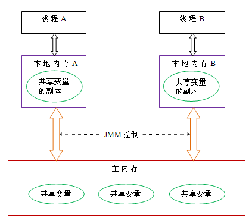
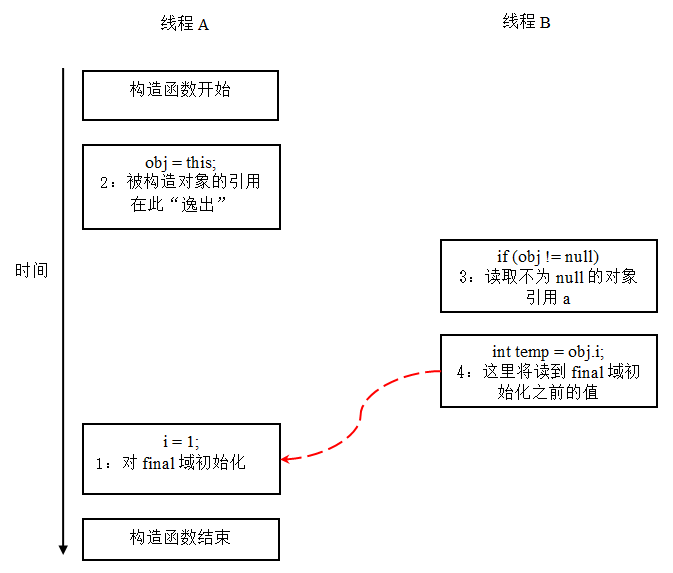

# 《深入理解Java内存模型》读书笔记

- [书目](#书目)
- [基础](#基础)
    - [并发编程模型](#并发编程模型)
    - [Java内存模型抽象](#java内存模型抽象)
        - [主内存与本地内存](#主内存与本地内存)
        - [JMM内存抽象](#jmm内存抽象)
    - [重排序](#重排序)
        - [定义](#定义)
    - [happens-before](#happens-before)
    - [数据依赖性](#数据依赖性)
    - [as-if-serial语义](#as-if-serial语义)
    - [多线程与重排序](#多线程与重排序)
    - [顺序一致性](#顺序一致性)
        - [顺序一致性内存模型](#顺序一致性内存模型)
        - [数据竞争与顺序一致性保证](#数据竞争与顺序一致性保证)
        - [同步程序的顺序一致性效果](#同步程序的顺序一致性效果)
    - [可见性](#可见性)
    - [原子性](#原子性)
- [同步基制](#同步基制)
    - [volatile](#volatile)
        - [作用](#作用)
        - [volatile变量的理解](#volatile变量的理解)
        - [volatile的内存语义](#volatile的内存语义)
        - [volatile和 synchronize对比](#volatile和-synchronize对比)
        - [使用指导](#使用指导)
    - [锁](#锁)
    - [final](#final)
        - [写final域的重排序规则](#写final域的重排序规则)
        - [读final域的重排序规则](#读final域的重排序规则)
        - [如果final域是引用类型](#如果final域是引用类型)
        - [为什么final引用不能从构造函数内“逸出”](#为什么final引用不能从构造函数内逸出)
        - [总结](#总结)

## 书目

- [深入理解java内存模型](http://ifeve.com/java-memory-model-0/)

## 基础

### 并发编程模型

- 共享内存与传递消息
- Java的并发采用的是共享内存模型，Java线程之间的通信总是隐式进行

### Java内存模型抽象

#### 主内存与本地内存

- 主内存(main memory),在java中，实例域、静态域和数组元素是线程之间共享的数据，它们存储在主内存中。
- 本地内存(即local memory),局部变量，方法定义参数和异常处理器参数是不会在线程之间共享的，它们存储在线程的本地内存中。

#### JMM内存抽象

- JMM定义了线程和主内存之间的抽象关系：线程之间的共享变量存储在主内存（main memory）中，每个线程都有一个私有的本地内存（local memory），本地内存中存储了该线程以读/写共享变量的副本。
- 本地内存是JMM的一个抽象概念，并不真实存在。它涵盖了缓存，写缓冲区，寄存器以及其他的硬件和编译器优化



### 重排序

#### 定义

- 在执行程序时为了提高性能，编译器和处理器常常会对指令做重排序
    - 编译器优化的重排序。编译器在不改变单线程程序语义的前提下，可以重新安排语句的执行顺序。
    - 指令级并行的重排序。现代处理器采用了指令级并行技术（Instruction-Level Parallelism， ILP）来将多条指令重叠执行。如果不存在数据依赖性，处理器可以改变语句对应机器指令的执行顺序。
    - 内存系统的重排序。由于处理器使用缓存和读/写缓冲区，这使得加载和存储操作看上去可能是在乱序执行

- 上述的1属于编译器重排序，2和3属于处理器重排序。这些重排序都可能会导致多线程程序出现内存可见性问题。
- 对于编译器，JMM的编译器重排序规则会禁止特定类型的编译器重排序（不是所有的编译器重排序都要禁止）。
- 对于处理器重排序，JMM的处理器重排序规则会要求java编译器在生成指令序列时，插入特定类型的内存屏障（memory barriers，intel称之为memory fence）指令，
 通过内存屏障指令来禁止特定类型的处理器重排序（不是所有的处理器重排序都要禁止）。
- JMM属于语言级的内存模型，**它确保在不同的编译器和不同的处理器平台之上，通过禁止特定类型的编译器重排序和处理器重排序，为程序员提供一致的内存可见性保证**

```java
public void write() {
    a = 1;
    b = 2;
}

public void read() {
    x = b;
    y = a;
}

// 由于处理器重排序，多线程最后可能的结果是 x = y = 0
```


### happens-before

- JSR -133内存模型,JSR-133使用happens-before的概念来阐述操作之间的内存可见性。
- **在JMM中，如果一个操作执行的结果需要对另一个操作可见，那么这两个操作之间必须要存在happens-before关系**。这里提到的两个操作既可以是在一个线程之内，也可以是在不同线程之间
- **两个操作之间具有happens-before关系，并不意味着前一个操作必须要在后一个操作之前执行！happens-before仅仅要求前一个操作（执行的结果）对后一个操作可见，且前一个操作按顺序排在第二个操作之前**

- happens-before规则
    - 程序顺序规则：一个线程中的每个操作，happens-before 于该线程中的任意后续操作。
    - 监视器锁规则：对一个监视器锁的解锁，happens-before 于随后对这个监视器锁的加锁。
    - volatile变量规则：对一个volatile域的写，happens-before 于任意后续对这个volatile域的读。
    - 传递性：如果A happens-before B，且B happens-before C，那么A happens-before C。


### 数据依赖性

- **如果两个操作访问同一个变量，且这两个操作中有一个为写操作，此时这两个操作之间就存在数据依赖性**
- **编译器和处理器在重排序时，会遵守数据依赖性，编译器和处理器不会改变存在数据依赖关系的两个操作的执行顺序**。
- 这里所说的**数据依赖性仅针对单个处理器中执行的指令序列和单个线程中执行的操作**，不同处理器之间和不同线程之间的数据依赖性不被编译器和处理器考虑

### as-if-serial语义

- **as-if-serial语义**：不管怎么重排序（编译器和处理器为了提高并行度），（单线程）程序的执行结果不能被改变。编译器，runtime 和处理器都必须遵守as-if-serial语义
- 为了遵守as-if-serial语义，编译器和处理器不会对存在数据依赖关系的操作做重排序，因为这种重排序会改变执行结果。**但是，如果操作之间不存在数据依赖关系，这些操作可能被编译器和处理器重排序**
- as-if-serial语义把单线程程序保护了起来，遵守as-if-serial语义的编译器，runtime 和处理器共同为编写单线程程序的程序员创建了一个幻觉：单线程程序是按程序的顺序来执行的。**as-if-serial语义使单线程程序员无需担心重排序会干扰他们，也无需担心内存可见性问题**

```java
double pi  = 3.14;    //A
double r   = 1.0;     //B
double area = pi * r * r;  // C

// A和C有依赖关系，B和C有依赖关系，可以保证A和B操作都在C之前，
// 但A和B因为不存在依赖关系，可以被重排序
```

### 多线程与重排序

```java
class ReorderExample {
    int a = 0;
    boolean flag = false;

    public void writer() {
        a = 1;                   //1
        flag = true;             //2
    }

    public void reader() {
        f (flag) {                 //3
            int i =  a * a;        //4
        }
    }
}
// 线程A执行writer方法，线程B执行reader方法
// 线程A中的1和2不存在依赖关系，可以重排序
// 线程B中的3和4存在依赖关系，不可以重排序
// 线程A中的重排序，则可以导致reader中的结果不正确
```


### 顺序一致性

#### 顺序一致性内存模型

- 顺序一致性内存模型是一个被计算机科学家理想化了的理论参考模型，它为程序员提供了极强的内存可见性保证。顺序一致性内存模型有两大特性：
    - 一个线程中的所有操作必须按照程序的顺序来执行。
    - 不管程序是否同步）所有线程都只能看到一个单一的操作执行顺序。在顺序一致性内存模型中，每个操作都必须原子执行且立刻对所有线程可见。


#### 数据竞争与顺序一致性保证

- java内存模型规范对数据竞争的定义如下：
    - 在一个线程中写一个变量，
    - 在另一个线程读同一个变量，
    - 而且写和读没有通过同步来排序。
- 当代码中包含数据竞争时，程序的执行往往产生违反直觉的结果（。如果一个多线程程序能正确同步，这个程序将是一个没有数据竞争的程序。

- JMM对正确同步的多线程程序的内存一致性做了如下保证：**如果程序是正确同步的，程序的执行将具有顺序一致性（sequentially consistent）–即程序的执行结果与该程序在顺序一致性内存模型中的执行结果相同**。这里的同步是指广义上的同步，包括对常用同步原语（lock，volatile和final）的正确使用

#### 同步程序的顺序一致性效果

- **JMM中，临界区内的代码可以重排序**（但JMM不允许临界区内的代码“逸出”到临界区之外，那样会破坏监视器的语义）。
- JMM会在退出监视器和进入监视器这两个关键时间点做一些特别处理，使得线程在这两个时间点具有与顺序一致性模型相同的内存视图

```java
class ReorderExample {
    int a = 0;
    boolean flag = false;

    public synchronized void writer() {
        a = 1;                   //1
        flag = true;             //2
    }

    public synchronized void reader() {
        f (flag) {                 //3
            int i =  a * a;        //4
        }
    }
}
```


### 可见性

- 可见性一般用于指不同线程之间的数据是否可见。

- 在java中， 实例域、静态域和数组元素这些数据是线程之间共享的数据，它们存储在主内存中；主内存中的所有数据对该内存中的线程都是可见的。
- 而局部变量，方法定义参数和异常处理器参数这些数据是不会在线程之间共享的，它们存储在线程的本地内存中；它们对其它线程是不可见的。
- 此外，对于主内存中的数据，在本地内存中会对应的创建该数据的副本(相当于缓冲)；这些副本对于其它线程也是不可见的。

### 原子性

- 是指一个操作是按原子的方式执行的。要么该操作不被执行；要么以原子方式执行，即执行过程中不会被其它线程中断。

## 同步基制

### volatile

#### 作用

- volatile变量具有以下特性：
    - **[可见性]**：对一个volatile变量的读，总是能看到（任意线程）对这个volatile变量最后的写入。
    - **[原子性]**：对任意单个volatile变量的读/写具有原子性，但类似于volatile++这种复合操作不具有原子性。


- 当第二个操作是volatile写时，不管第一个操作是什么，都不能重排序。这个规则确保volatile写之前的操作不会被编译器重排序到volatile写之后。
- 当第一个操作是volatile读时，不管第二个操作是什么，都不能重排序。这个规则确保volatile读之后的操作不会被编译器重排序到volatile读之前。
- 当第一个操作是volatile写，第二个操作是volatile读时，不能重排序

#### volatile变量的理解

- 理解volatile特性的一个好方法是：把对volatile变量的单个读/写，看成是使用同一个锁对这些单个读/写操作做了同步

```java
class VolatileFeaturesExample {
    //使用volatile声明64位的long型变量
    volatile long vl = 0L;

    public void set(long l) {
        vl = l;   //单个volatile变量的写
    }

    public void getAndIncrement () {
        vl++;    //复合（多个）volatile变量的读/写
    }

    public long get() {
        return vl;   //单个volatile变量的读
    }
}
```

```java
class VolatileFeaturesExample {
    long vl = 0L;               // 64位的long型普通变量

    //对单个的普通 变量的写用同一个锁同步
    public synchronized void set(long l) {
       vl = l;
    }

    public void getAndIncrement () { //普通方法调用
        long temp = get();           //调用已同步的读方法
        temp += 1L;                  //普通写操作
        set(temp);                   //调用已同步的写方法
    }
    public synchronized long get() { 
        //对单个的普通变量的读用同一个锁同步
        return vl;
    }
}
```

#### volatile的内存语义

- volatile写：当写一个volatile变量时，JMM会把该线程对应的本地内存中的共享变量刷新到主内存。
- volatile读：当读一个volatile变量时，JMM会把该线程对应的本地内存置为无效。线程接下来将从主内存中读取共享变量
- **从内存语义的角度来说，volatile与锁有相同的效果：volatile写和锁的释放有相同的内存语义；volatile读与锁的获取有相同的内存语义**

#### volatile和 synchronize对比

- 在功能上，监视器锁比volatile更强大；在可伸缩性和执行性能上，volatile更有优势。
- volatile仅仅保证对单个volatile变量的读/写具有原子性；而synchronize锁的互斥执行的特性可以确保对整个临界区代码的执行具有原子性。

#### 使用指导

[正确使用 Volatile 变量](https://www.ibm.com/developerworks/cn/java/j-jtp06197.html)

### 锁

- 对比锁释放-获取的内存语义与volatile写-读的内存语义，可以看出：锁释放与volatile写有相同的内存语义；锁获取与volatile读有相同的内存语义。

- 锁的内存语义
    - 线程A释放一个锁，实质上是线程A向接下来将要获取这个锁的某个线程发出了（线程A对共享变量所做修改的）消息。
    - 线程B获取一个锁，实质上是线程B接收了之前某个线程发出的（在释放这个锁之前对共享变量所做修改的）消息。
    - 线程A释放锁，随后线程B获取这个锁，这个过程实质上是线程A通过主内存向线程B发送消息

### final

#### 写final域的重排序规则

- 在构造函数内对一个final域的写入，与随后把这个被构造对象的引用赋值给一个引用变量，这两个操作之间不能重排序,
- JMM禁止编译器把final域的写重排序到构造函数之外
- 写final域的重排序规则可以确保：**在对象引用为任意线程可见之前，对象的final域已经被正确初始化过了，而普通域不具有这个保障。**

```java
public class FinalExample {
    int i;                            //普通变量
    final int j;                      //final变量
    static FinalExample obj;

    public void FinalExample () {     //构造函数
        i = 1;                        //写普通域
        j = 2;                        //写final域
    }

    public static void writer () {    //写线程A执行
        obj = new FinalExample ();
    }

    public static void reader () {       //读线程B执行
        FinalExample object = obj;       //读对象引用
        int a = object.i;                //读普通域
        int b = object.j;                //读final域
    }
}
// 写线程A先执行，然后执行读线程B
// 可以保证，只要只要B线程看到obj不为null,那么obj中的j一定为2
// 而B看到obj不为null,obj中的i因为不是final则不一定能读到正确的值
```

#### 读final域的重排序规则

- 在一个线程中，初次读对象引用与初次读该对象包含的final域，JMM禁止处理器重排序这两个操作（注意，这个规则仅仅针对处理器）。
- 读final域的重排序规则可以确保：**在读一个对象的final域之前，一定会先读包含这个final域的对象的引用。如果该引用不为null，那么引用对象的final域一定已经被A线程初始化过了。**

#### 如果final域是引用类型

- 在构造函数内对一个final引用的对象的成员域的写入，与随后在构造函数外把这个被构造对象的引用赋值给一个引用变量，
 这两个操作之间不能重排序

 ```java
 public class FinalReferenceExample {
    final int[] intArray;                     //final是引用类型
    static FinalReferenceExample obj;

    public FinalReferenceExample () {        //构造函数
        intArray = new int[1];               //1
        intArray[0] = 1;                    //2
    }

    public static void writerOne () {          //写线程A执行
        obj = new FinalReferenceExample ();   //3
    }

    public static void writerTwo () {          //写线程B执行
        obj.intArray[0] = 2;                  //4
    }

    public static void reader () {              //读线程C执行
        if (obj != null) {                     //5
            int temp1 = obj.intArray[0];       //6
        }
    }
}

 ```

- 假设线程A执行writerOne()方法，执行完后线程B执行writerTwo()方法，执行完后线程C执行reader ()方法
- 1是对final域的写入，2是对这个final域引用的对象的成员域的写入，3是把被构造的对象的引用赋值给某个引用变量。
- **这里除了前面提到的1不能和3重排序外，2和3也不能重排序。**
- JMM可以确保读线程C至少能看到写线程A在构造函数中对final引用对象的成员域的写入。即C至少能看到数组下标0的值为1。
- 而写线程B对数组元素的写入，读线程C可能看的到，也可能看不到。JMM不保证线程B的写入对读线程C可见，因为写线程B和读线程C之间存在数据竞争，此时的执行结果不可预知。

#### 为什么final引用不能从构造函数内“逸出”

- 写final域的重排序规则可以确保：在引用变量为任意线程可见之前，该引用变量指向的对象的final域已经在构造函数中被正确初始化过了。
 其实要得到这个效果，还需要一个保证：**在构造函数内部，不能让这个被构造对象的引用为其他线程可见，也就是对象引用不能在构造函数中“逸出”。**
- **在构造函数返回前，被构造对象的引用不能为其他线程可见，因为此时的final域可能还没有被初始化。**
- **在构造函数返回后，任意线程都将保证能看到final域正确初始化之后的值**

```java
public class FinalReferenceEscapeExample {
    final int i;
    static FinalReferenceEscapeExample obj;

    public FinalReferenceEscapeExample () {
        i = 1;                              //1写final域
        obj = this;                         //2 this引用在此“逸出”
    }

    public static void writer() {
        new FinalReferenceEscapeExample ();
    }

    public static void reader {
        if (obj != null) {                    // 3
            int temp = obj.i;                 // 4
        }
    }
}
```



#### 总结

- 只要对象是正确构造的（被构造对象的引用在构造函数中没有“逸出”），那么不需要使用同步（指lock和volatile的使用），就可以保证任意线程都能看到这个final域在构造函数中被初始化之后的值。