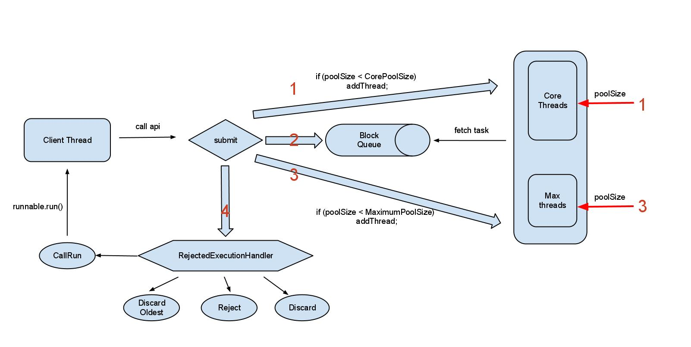

# 多线程

- [参考书目](#参考书目)
- [线程与进程](#线程与进程)
- [线程的状态](#线程的状态)
- [线程sleep\(\)](#线程sleep\\)
- [线程优先级](#线程优先级)
- [线程yield\(\)](#线程yield\\)
- [线程 join\(\)](#线程-join\\)
- [后台线程](#后台线程)
- [异常](#异常)
- [使用Executor管理thread对象](#使用executor管理thread对象)
- [ThreadFactory](#threadfactory)
- [从任务中返回值](#从任务中返回值)
- [线程安全和共享资源](#线程安全和共享资源)
    - [局部变量](#局部变量)
    - [局部的对象引用](#局部的对象引用)
    - [对象成员](#对象成员)
    - [线程控制逃逸规则](#线程控制逃逸规则)
- [解决共享资源兑争\(互斥性\)](#解决共享资源兑争\互斥性\)
- [同步与锁](#同步与锁)
    - [同步](#同步)
    - [synchronized 与锁](#synchronized-与锁)
    - [共享资源](#共享资源)
    - [显示的lock对象](#显示的lock对象)
- [原子性与可见性](#原子性与可见性)
    - [原子性](#原子性)
    - [可见性 与Volatile](#可见性-与volatile)
    - [Volatile](#volatile)
    - [原子类](#原子类)
- [临界区](#临界区)
- [ThreadLocal](#threadlocal)
- [线程阻塞](#线程阻塞)
- [中断](#中断)
    - [中断相关的函数](#中断相关的函数)
    - [处理中断](#处理中断)
    - [join wait sleep与中断](#join-wait-sleep与中断)
        - [wait 与interrupt](#wait-与interrupt)
        - [sleep 与 interrupt](#sleep-与-interrupt)
        - [总结](#总结)

## 参考书目

- [并发编程网](http://ifeve.com/java-concurrency-thread-directory/)
- [正确使用 Volatile 变量](https://www.ibm.com/developerworks/cn/java/j-jtp06197.html)
- [Java多线程编程总结](http://lavasoft.blog.51cto.com/62575/27069)

## 线程与进程

- 进程是运行在它自己的地址空间内的自包容程序
- 一个线程就是在进程中的一个顺序控制流

## 线程的状态

- 线程状态简图


- **新状态**：线程对象已经创建，它只会短暂的处于这种状态，已经分配了资源，并执行了必要的初始化，线程已经有资格获得cpu的时间，之后调度器将把线程变为可运行状态或者阻塞状态。
- **可运行状态**：这种状态下，只要调度器把时间分配给线程，线程就可以运行，所以**任何时刻，线程可以在运行也可以没有在运行**。当start\(\) 方法调用时，线程首先进入可运行状态。在线程运行之后或者从阻塞、等待或睡眠状态回来后，也返回到可运行状态。
- **阻塞**：线程可以运行，但是有某个条件阻止了它运行，当线程处于阻塞状态，调度器将忽略线程，不会分配给线程任何cpu时间,直到线程重新进入就绪状态，它才有可能执行操作
- **死亡态**：处于死亡或者终止状态的线程不再是可以被调度的，也不会再得到cpu时间，它的作务已经经结束，或者不再是可以运行的。作务死亡的通常情况是run\(\)方法执行完成，但是任务的线程还可以被中断。这个线程对象也许是活的，但是，它已经不是一个单独执行的线程。线程一旦死亡，就不能复生.如果在一个死去的线程上调用start\(\)方法，会抛出java.lang.IllegalThreadStateException异常。

- **使线程进入阻塞状态的方法**：

  - 调用Thread.sleep\(\)： 使线程进入休眠状态，任务在指定时间内不会运行，**不释放锁**;
  - 调用Thread.yield\(\)：不能保障太多事情，尽管通常它会让当前运行线程回到可运行性状态，使得有相同优先级的线程有机会执行，**不释放锁**
  - 调用join\(\)方法：保证当前线程停止执行，直到该线程所加入的线程完成为止。然而，如果它加入的线程没有存活，则当前线程不需要停止;
  - 在对象上调用wait\(\)方法，**释放锁**，使当前线程挂起，直到线程得到了notify或都notifyAll的消息;
  - 线程不能在对象上获得锁定，它正试图运行该对象的方法代码;
  - 线程调度程序可以决定将当前运行状态移动到可运行状态，以便让另一个线程获得运行机会，而不需要任何理由

## 线程sleep()

- 线程休眠的目的是使线程让出CPU的最简单的做法之一，线程休眠时候，会将CPU资源交给其他线程，以便能轮换执行，当休眠一定时间后，线程会苏醒，进入准备状态等待执行
- 线程休眠不会释放对象的锁
- 两种方法调用是一样的，将当前thread,休眠掉

```java
    try {
        Thread.sleep(7*1000);
    } catch (InterruptedException e) {
        e.printStackTrace();
    }

    try {
        TimeUnit.SECONDS.sleep(7);
    } catch (InterruptedException e) {
        e.printStackTrace();
    }
```

## 线程优先级

- 调度器倾向于让优先级最高的线程先执行，但是并不是意味着低优先权的线程将得不到执行，也就是说优先权不会导致死锁
- 试图操纵线程优先级通常是一种错误
- 优先级是在run\(\)方法中设定的，在构造器中设置它们不会有任何好处，因为Executor此时还没有开始执行任务
- Thread.MAX\_PRIORITY, NORMAL\_PRIORITY,MIN\_PRIORITY

## 线程yield\(\)

- 暗示cpu，工作差不多了，可以让别的线程使用cpu了
- 仅是一个暗示作用，没有任何机制可以保证它会被采纳
- 当调用yield（\)时，也是在建议相同有限级的其它线程可以运行
- 调用Thread.yield\(\),当前线程从运行状态变为可运行状态

## 线程 join\(\)

- **a线程的run中调用b.join\(\)，a会被挂起，直到线程b结束才恢复（也就是b.isAlive（）为假）**
- 在一个线程上调用interrupt\(\)时，将给该线程一个标志，表明该线程已经被中断，但是如果捕获了这个异常，则这个标志会被清除

## 后台线程

- **setDaemon\(true\)，必须在调用线程的start\(\)方法之前调用**
- 后台线程是提供一种通用服务的线程，并且这种线程并不属于程序中不可或缺的一部分
- 当程序的所有非后台线程结束时，程序也就结束了，并且会杀死所有后台线程
- 只要存在任何非后台线程还在运行，程序就不会终止
- **任何后台线程创建的线程都是后台线程**
- **当关闭最后一个非后台线程时，所有的后台线程都会被立即关闭，可能会导致后台线程的部分代码不会执行**，如果是非后台线程，则代码一定会执行

```java
class ADaemon implements Runnable {
    public void run() {
        try {
            print("Starting ADaemon");
            TimeUnit.SECONDS.sleep(1);
        } catch (InterruptedException e) {
          print ("Exiting via InterruptedException");
        } finally {
            print ("This should always run ?");
        }
    }


    public class DaemonsDontRunFinally {
        public static void main(String[] args) throws Exception {
            Thread t = new Thread(new ADaemon());
            t.setDaemon(true);
            t.start();
        }
    }
}

// output
// Starting ADaemon
// 其它的不会执行的
```

- 非后台的Executor是一种更好的方式，它可以控制所有任务可以同时被关闭

## 异常

- **由于线程的本质特性，不能捕获从线程中逃逸出来的异常**
- 使用Thread.UncaughtExceptionHandler
- UncaughtExceptionHandler主要分为3类：**Thread特有的，它所属线程组特有的，和所有Thread共有的DefaultUncaughtExceptionHandler**
- **还可以在Thread类中设置一个静态域，当线程不存在特有UncaughtExceptionHandler版本的，**
  **并且也没有线程组专有UncaughtExceptionHandler的时候，就会使用defaultUncaughtExceptionHandler**
  Thread.setDefaultUncaughtExceptionHandler\(new MyUncaughtExceptionHandler\(\)\);

```java
class MyUncaughtExceptionHandler implements
Thread.UncaughtExceptionHandler {
  public void uncaughtException(Thread t, Throwable e) {
    System.out.println("caught " + e);
  }
}
class HandlerThreadFactory implements ThreadFactory {
  public Thread newThread(Runnable r) {
    System.out.println(this + " creating new Thread");
    Thread t = new Thread(r);
    System.out.println("created " + t);
    t.setUncaughtExceptionHandler(
      new MyUncaughtExceptionHandler());
    System.out.println(
      "eh = " + t.getUncaughtExceptionHandler());
    return t;
  }
}
 ExecutorService exec = Executors.newCachedThreadPool(
      new HandlerThreadFactory());
```

## 使用Executor管理thread对象

- FixedThreadPool
- CachedThreadPool,通常会创建与所需相同数量的线程，然后在它回收旧线程时停止创建新线程
- SingleThreadExecutor，对于希望在同一个线程中连续运行的任何事物（长期存在的任务，比如长连接）来说，都是很有用的。
- 如果向SingleThreadExecutor中提交了多个任务，这些任务将排队，每个任务都会在下一个任务开始之前运行结束，
  所有的任务将使用相同的线程。因些它会序列化所有提交给它的任务，并会维护它自己的悬挂任务队列。
- SingleThreadExecutor上，由于是在同一线程，经常不需要在共享资源上作同步。

### ThreadPoolExecutor

```java
public ThreadPoolExecutor(int corePoolSize,int maximumPoolSize,long keepAliveTime,
    TimeUnit unit,BlockingQueue<Runnable> workQueue,
    ThreadFactory threadFactory,RejectedExecutionHandler handler) {
    //...
}
```

- **corePoolSize**:核心线程数，**默认情况下核心线程会一直存活，即使处于闲置状态也不会受存keepAliveTime限制**。
 除非将allowCoreThreadTimeOut设置为true。
- **maximumPoolSize**: **线程池所能容纳的最大线程数**。超过这个数的线程将被阻塞。当任务队列为没有设置大小的LinkedBlockingDeque时，这个值无效。
- **keepAliveTime**:非核心线程的闲置超时时间，超过这个时间就会被回收
- **unit**:指定keepAliveTime的单位
- **workQueue**:线程池中的任务队列,常用的有三种队列，SynchronousQueue,LinkedBlockingDeque,ArrayBlockingQueue。
- **threadFactory**:线程工厂，提供创建新线程的功能
- **RejectedExecutionHandler**:当线程池中的资源已经全部使用，添加新线程被拒绝时，会调用RejectedExecutionHandler的rejectedExecution方法

#### execute策略

- [ThreadPoolExecutor几点使用建议](https://yq.aliyun.com/articles/14592)
- [一心多用多线程-线程池ThreadPoolExecutor](http://blog.csdn.net/hayre/article/details/53291712)



- 当前正在运行的线程的数目小于corePoolSize，会走上图的第一步，直接new一个Thread，并将runnable作为线程的初始任务，立马执行
- 当提交的任务数超过了corePoolSize，就进入了上图第二步操作，会尝试将当前的runable加到一个block queue中
    - 如果加入成功，此时即使工作线程数目小于maxnumPoolSize,也是不会创建线程的
    - 如果blockqueue是个有界队列并且队列满了，加入失败就会走上图的第三步，此时如果poolSize < maximumPoolsize时，会尝试new 一个Thread的进行救急处理，立马执行对应的runnable任务
- 如果第三步救急方案也无法处理了，就会走到第四步执行reject操作

#### 任务的排队

- 如果运行的线程少于 corePoolSize，则 Executor 始终首选添加新的线程，而不进行排队。
- 如果运行的线程等于或多于 corePoolSize，则 Executor 始终首选将请求加入队列，而不添加新的线程。
- 如果无法将请求加入队列，则创建新的线程，除非创建此线程超出 maximumPoolSize，在这种情况下，任务将被拒绝

#### BlockingQueue

- ArrayBlockingQueue :  有界的数组队列
- LinkedBlockingQueue : 可支持有界/无界的队列，使用链表实现
- PriorityBlockingQueue : 优先队列，可以针对任务排序
- SynchronousQueue : 队列长度为1的队列，和Array有点区别就是：client thread提交到block queue会是一个阻塞过程，直到有一个worker thread连接上来poll task

- 直接提交。工作队列的默认选项是SynchronousQueue，它将任务直接提交给线程而不保持它们。在此，如果不存在可用于立即运行任务的线程，则试图把任务加入队列将失败，因此会构造一个新的线程。此策略可以避免在处理可能具有内部依赖性的请求集时出现锁。**直接提交通常要求无界maximumPoolSizes 以避免拒绝新提交的任务**。当命令以超过队列所能处理的平均数连续到达时，此策略允许无界线程具有增长的可能性。
- 无界队列。使用无界队列（例如，不具有预定义容量的 LinkedBlockingQueue）将导致在所有 corePoolSize线程都忙时新任务在队列中等待。这样，**创建的线程就不会超过 corePoolSize，因此，maximumPoolSize的值也就无效了。**当每个任务完全独立于其他任务，即任务执行互不影响时，适合于使用无界队列；例如，在 Web页服务器中。这种排队可用于处理瞬态突发请求，当命令以超过队列所能处理的平均数连续到达时，此策略允许无界线程具有增长的可能性。
- 有界队列。当使用有限的 maximumPoolSizes 时，有界队列（如ArrayBlockingQueue）有助于防止资源耗尽，但是可能较难调整和控制。队列大小和最大池大小可能需要相互折衷：**使用大型队列和小型池可以最大限度地降低CPU 使用率、操作系统资源和上下文切换开销，但是可能导致人工降低吞吐量**。如果任务频繁阻塞（例如，如果它们是 I/O边界），则系统可能为超过您许可的更多线程安排时间。**使用小型队列通常要求较大的池大小，CPU使用率较高，但是可能遇到不可接受的调度开销，这样也会降低吞吐量**

#### RejectExecutionHandler

- Reject 直接抛出Reject exception
- Discard 直接忽略该runnable，不可取
- DiscardOldest 丢弃最早入队列的的任务
- CallsRun 直接让原先的client thread做为worker线程，进行执行

## ThreadFactory

- 每个ExecutorService的创建方法都被重载为接受一个ThreadFactory对象，而这个对象被用来创建对象

```java
public class DaemonThreadFactory implements ThreadFactory {
        public Thread newThread(Runnable r) {
              Thread t = new Thread();
              t.setDaemon(true);
              return t;
        }
}

ExecutorService exec = Executors.newCachedThreadPool(new DaemonThreadFactory());
```

## 从任务中返回值

- Runnable执行独立的任务，但不返回值，如果要返回值，使用Callable
- Callable一般用ExecutorService.submit\(\)方法调用它,submit产生Future对象
- 可以用isDone\(\)来检测Future是否完成
- 也可以直接调用get\(\)，但是会阻塞线程

```java
class Task implements Callable<String> {
  private int id;
  public Task(int id) {
    this.id = id;
  }

  public String call(){
    return "result of Task" + id;
  }
}
ExecutorService exec = Executors.newCachedThreadPool();
List<Future<String>> list = new ArrayList<>();
for(int i = 0; i < 10; ++i) {
  list.add(exec.submit(new Task(i)));
}
```

## 共享资源

> > Brian同步原则：如果你正在写一个变量，它可能接下来被另一个线程读取，或者正在读取一个上一次已经被另一个线程写过的变量，那么你必须使用同步，并且，读写线程必须用相同的监视器锁同步

- **同步损害并发性，应该尽可能缩小同步范围**。
- **同步不但可以同步整个方法，还可以同步方法中一部分代码块**。
- **在使用同步代码块时候，应该指定在哪个对象上同步，也就是说要获取哪个对象的锁**

```java
// 下面两个效果相同
class A {
    public synchronized void someThing() {
         //
    }

    public  void someThing() {
        synchronized(this) {
            //...
        }
    }
}
```

- **每一个访问临界共享资源的方法都必须同步，否则它们就不会正常工作**
- **线程睡眠时，它所持的任何锁都不会释放**。
- 编写线程安全的类，需要时刻注意对多个线程竞争访问资源的逻辑和安全做出正确的判断，对“原子”操作做出分析，并保证原子操作期间别的线程无法访问竞争资源

## 线程安全和共享资源

### 局部变量

- 局部变量存储在线程自己的栈中。也就是说，局部变量永远也不会被多个线程共享。所以，**基础类型的局部变量是线程安全的**

```java
public void someMethod(){
  long threadSafeInt = 0;
  threadSafeInt++;
}

```

### 局部的对象引用

- 对象的局部引用和基础类型的局部变量不太一样。尽管引用本身没有被共享，但引用所指的对象并没有存储在线程的栈内。所有的对象都存在共享堆中。
- 如果在某个方法中创建的对象不会逃逸出该方法，那么它就是线程安全的。
- 实际上，哪怕将这个对象作为参数传给其它方法，只要别的线程获取不到这个对象，那它仍是线程安全的.

```java
public void someMethod(){
    LocalObject localObject = new LocalObject();
    localObject.callMethod();
    method2(localObject);
}

public void method2(LocalObject localObject){
  localObject.setValue("value");
}
```

### 对象成员

- 对象成员存储在堆上。如果两个线程同时更新同一个对象的同一个成员，那这个代码就不是线程安全的

```java
public class NotThreadSafe{
    StringBuilder builder = new StringBuilder();

    public add(String text){
        this.builder.append(text);
    }
}
```

### 线程控制逃逸规则

- **如果一个资源的创建，使用，销毁都在同一个线程内完成，且永远不会脱离该线程的控制，则该资源的使用就是线程安全的。**

## 线程安全及不可变性

- 我们可以通过创建不可变的共享对象(**Immutable**)来保证对象在线程间共享时不会被修改，从而实现线程安全

- **即使一个对象是线程安全的不可变对象，指向这个对象的引用也可能不是线程安全的**

## 解决共享资源兑争\(互斥性\)

- **对于并发工作，需要某种方式来防止两个任务访问相同的资源**，至少在关键时刻不能这样，**防止这种冲突的方法就是当资源被一个任务使用时，在其上加锁**
- **基本上所有的并发模式在解决线程冲突问题的时候，都是采用序列化访问共享资源的方案，这意味着在给定时刻只允许一个任务访问共享资源**
- java中，要控制对共享资源的访问，首先得把它包装进一个对象，然后把所有要访问这个资源的方法标记为synchronized
  使用并发时，必须将值设为private

## 同步与锁

### 同步

- 当提到同步时，应该清楚在什么上同步？也就是说，在哪个对象上同步？
- 不必同步类中所有的方法，**类可以同时拥有同步和非同步方法**，如果线程拥有同步和非同步方法，则非同步方法可以被多个线程自由访问而不受锁的限制。

### synchronized 与锁

- **使用并发时，必须将要保护的成员对象设置为private**
- **synchronized 只能同步方法和代码块**，不能同步变量和类
- **所有对象都自动含有单一的锁，在对象上调用任何 synchronized方法，对象会被加锁**
- **一个任务可以获得多个对象的锁**, 在一个对象的同步方法里面调用另外一个对象的同步方法，则获取了两个对象的同步锁。
- **一个任务也可以多次获得对象的锁**，比如在一个对象的synchronized方法里面调用这个对象的另一个synchronized汶法，那么每调用一次都会加锁一次，
  jvm会追踪加锁的次数，退出一个synchronized方法或代码块，加锁次数减1，当变为0时，释放对象的锁
- **对于某个对象来说，其所有非static synchronized方法共享一个锁**,如果某个任务处于一个对标记为synchronized的方法调用中，
  那么在这个线程从该方法返回之前，其它所有要调用类中任何标记为synchronized方法的线程都会被堵塞
- 每一个类也有一个锁，作为class对象的一部分，所以**synchronized static方法可以在类的范围内防止对static数据的并发访问**

```java
// 下面两个效果相同
class A {
    public static synchronized void staticMethod() {
         //
    }

    public static void staticMethod() {
        synchronized(A.class) {
            //...
        }
    }
}
```

### 显示的lock对象

- 显示的lock对象一般和try finally合在一起用，并且一定要在finally中unlock
- 如果失败可以抛出异常，也可以在finally中清理对象

```java
public class A {
    private final Lock lock = new ReentrantLock();

    private int value = 0;

    public int next() {
        lock.lock();
        try {
            ++value;
            Thread.yield();
            ++value;
            return value;
        } finally {
            lock.unlock();
        }
    }
}
```

## 原子性与可见性

### 原子性

- **原子操作是不能被线程调度机制中断的操作，一旦操作完成，那么它一定可以在可能发生的“上下文切换“（切换到其它线程）之前执行完毕**
- **原子性可以应用于除了long与double之外的所有基本类型之上的读写操作**，可以保证它们会被当作不可分的操作来操作内存
- long,与double因为是64位，读取和写入被当作两个分离的32位操作来执行，从而可能在一个读取与写入之间发生上下文切换，处于不正确的状态
- **将long和double定义为volatile,就会获得简单的返回与赋值的原子性**
- **尝试用原子性来代替同步是一种不成熟的优化**，并且会给你招致大量的麻烦

### 可见性 与Volatile

- 在多处理器的系统中，**可见性的问题比原子性的问题更加严重**
- **一个任务做出的修改，即使在不中断的意义上讲是原子性的，对其它任务也有可能是不可见的**，有可能修改只是暂时性地存储在本地处理器的缓存中，没有刷新到主存中，造成可能对于其它线程是不可见的
- **没有同步机制，可视性无法确定**

### Volatile

- **volatile关键字，确保了应用中的可见性，如果将一个域声明为violatile,那么只要对这个域产生了写操作，那么所有的读操作都可以看到这个修改**,即使有本地缓存，情况也是如此，volatile域被立即写到主存中，而读取操作就是发生在主存的
- 在非volatile域上的原子操作不必刷新到主存中，因此其它读取该域的任务也不一定看到这个新值，没有保证可视性
- **如果多个任务在同时访问这个域，那么这个域就应当是volatie的，否则，这个域就应当只能经由同步的来访问，也就是任何读写这个域的方法应当被synchronized保护**
- **如果一个域完全由synchronized方法和语句块来防护，那么这个域不必声明为volatile**
- **一个任务所作的任何写入操作对这个任务都是可见的,如果它只需要这个任务内部可见,那么它不必设置为volatile**
- **volatile 但是本身却不能保证原子性与互斥性**
- **如果一个域的值依赖于它之前的值（例如一个递增计数器），volatile它就无法工作了**

```java
// volatile保证了可见性，但是由于自增操作不是原子性的，所有这个类不是线程安全的
public class SerialNumberGenerator {
    public static volatile int serialNumber = 0;

    public static int next() {
        return serialNumber++;
    }
}
```

- **如果某个域的值受到其它域的限制，比如Range的lower必须满足lower&lt;= upper，volatile它就无法工作了**
- **使用volatile而不是synchronized的唯一安全的情况是类中只有一个可变的域,只要将这个域设置成volatile,这个类就保证了线程安全**
- **如果一个域可能会被多个任务同时访问，或者这些任务中至少有一个是写入任务，那么就应当将这个域设置为volatile的**

### 原子类

- 原子类，AtomicInteger, AtomicLong, AtomicReference等
- 只有在特殊的情况下，才使用原子类，**一般情况下依赖于锁，synchronized或显式的lock对象更安全**

```java
// 在多线程中使用没有同步的eventIncrement也不会出现问题
public class AtomicIntegerTest implements Runnable {
    private AtomicInteger i =  new AtomicInteger(0);

   public int getValue() {return i.get();}

   public void eventIncrement() { i.addAndGet(2);}

   public void run() {
       //....
   }
}
```

## 临界区

- 当两个线程竞争同一资源时，如果对资源的访问顺序敏感，就称存在竞态条件。导致竞态条件发生的代码区称作临界区
- 希望防止多个线程同时访问方法内部的部分代码而不是防止访问整个方法，通过这种方法分离出来的代码段被称为临界区
- synchronized必须给定一个在其上进行同步的对象，其中最合理的方式是，使用其方法正在被调用的当前对象\(this\)，synchronized非静态方法就是这样
- 有时如果要在另一个对象上同步，则必须保证所有相关的作务都是在一个对象上同步
- synchronized\(this\)与synchronized当前对象内部的一个对象，两者不会因为对另一个方法的调用而互相阻塞
- 使用临界区必须明确在哪个对象上加锁，也就是synchronized哪个对象

```java
// 下面例子中，f与g互斥，因为两者都要获得对象的锁
// f与h，g与h可以同时被不同线程访问，两者加锁的对象是不同的
public class A {
    private final Object lock = new Object();

    public synchronized void f () {
        //....
    }

    public void g() {
        synchronized(this) {
            //...
        }
    }

    public void h() {
        synchronized(lock) {
            //...
        }
    }


}
```

## ThreadLocal

- 防止任务在共享资源上产生冲突的第二次种方式，根除对变量的共享
- ThreadLocal,为使用相同变量的每个不同线程都创建不同的存储

## 线程阻塞

- 调用同一个对象中非静态同步方法的线程将彼此阻塞。如果是不同对象，则每个线程有自己的对象的锁，线程间彼此互不干预。
- 调用同一个类中的静态同步方法的线程将彼此阻塞，它们都是锁定在相同的Class对象上。
- 静态同步方法和非静态同步方法将永远不会彼此阻塞，因为静态方法锁定在Class对象上，非静态方法锁定在该类的对象上。
- 对于同步代码块，要看清楚什么对象已经用于锁定（synchronized后面括号的内容）。在同一个对象上进行同步的线程将彼此阻塞，在不同对象上锁定的线程将永远不会彼此阻塞。

## 中断

> > 没有任何语言方面的需求要求一个被中断的程序应该终止。中断一个线程只是为了引起该线程的注意，被中断线程可以决定如何应对中断

- **线程中断，并不是让线程停止执行**
- 在java中,**线程的中断\(interrupt\)只是改变了线程的中断状态,至于这个中断状态改变后带来的结果,那是无法确定的,必须由程序的调用者去处理**
  有时它更是让停止中的线程继续执行的唯一手段.不但不是让线程停止运行,反而是继续执行线程的手段.
- ExecutorService的shutdownNow将向所有由ExecutorService启动的任务发送interrupt

### 中断相关的函数

```java
 public void interrupt();

 public native boolean isInterrupted();

 public static native boolean interrupted();
```

- **interrupt\(\)**:设置线程的中断状态为true, 并不会导致线程停止运行
- **isInterrupted\(\)**:返回线程是否中断了
- **interrupted\(\)**：返回线程的上次的中断状态，**并清除中断状态**

### 处理中断

- 如果我们没有处理中断,那么对线程调用中断,将没有任何的用处,
  比如对A所在的线程调用interrupt，没有任何的作用，只有一个置位为中断状态的作用
  但是如果我们对于B调用interrrupt，由于线程一直在轮询是否中断，所以如果中断了，那么程序会跳出循环

```java
public class A implements Runnable {

    @Override
    public void run() {
        // do something
    }
}

public class B implements Runnable {
     @Override
    public void run() {
       while (!Thread.isInterrupted()) {
            // do something
       }
    }
}
```

### join wait sleep与中断

- 一个线程调用了interrupt\(\)后,它的状态是已中断的.这个状态对于正在执行wait,join,sleep的线程,改变了线程的运行结果.

#### wait 与interrupt

- 对于wait中等待notify/notifyAll唤醒的线程,其实这个线程已经"暂停"执行,因为它正在某一对象的休息室中,这时如果它的中断状态被改变,那么它就会抛出异常.
  这个InterruptedException异常不是线程抛出的,而是wait方法,也就是对象的wait方法内部会不断检查在此对象上休息的线程的状态,如果发现哪个线程的状态被置为已中断,
  则会抛出InterruptedException,意思就是这个线程不能再等待了,其意义就等同于唤醒它了.

- 这里唯一的区别是,被notify/notifyAll唤醒的线程会继续执行wait下面的语句,而在wait中被中断的线程则将控制权交给了catch语句.一些正常的逻辑要被放到catch中来运行.
  但有时这是唯一手段,比如一个线程a在某一对象b的wait中等待唤醒,其它线程必须获取到对象b的监视锁才能调用b.notify\(\)否则你就无法唤醒线程a,但在任何线程中可以无条件地调用a.interrupt\(\)来达到这个目的.
  只是唤醒后的逻辑你要放在catch中,当然同notify/notifyAll一样,继续执行a线程的条件还是要等拿到b对象的监视锁.

#### sleep 与 interrupt

- 对于sleep中的线程,如果你调用了Thread.sleep\(一年\);现在你后悔了,想让它早些醒过来,调用interrupt\(\)方法就是唯一手段,
  只有改变它的中断状态,让它从sleep中将控制权转到处理异常的catch语句中,然后再由catch中的处理转换到正常的逻辑.
  同样,地于join中的线程你也可以这样处理.

#### 总结

- 在已经调用join/wait/sleep这三个方法的线程上调用interrupt\(\)方法,可以让线程从"暂停"状态中恢复过来.这个恢复过来就可以包含两个目的:
  - **\[可以使线程继续执行\]**,那就是在catch语句中执行醒来后的逻辑,或由catch语句转回正常的逻辑.总之它是从wait,sleep,join的暂停状态活过来了.
  - **\[可以直接停止线程的运行\]**,当然在catch中什么也不处理,或return,那么就完成了当前线程的使命,可以使在上面"暂停"的状态中立即真正的"停止".