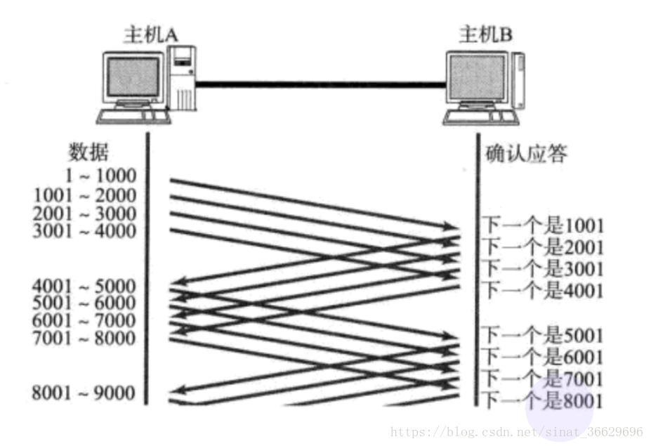
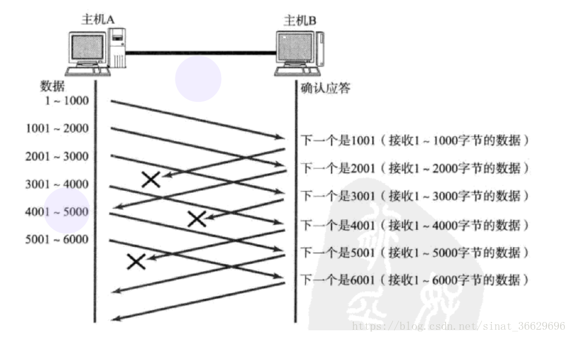
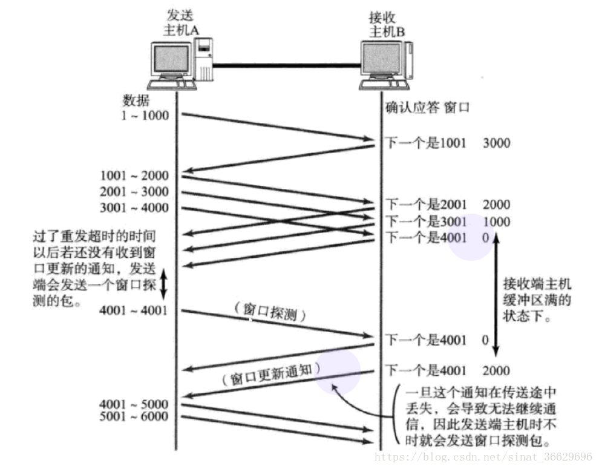
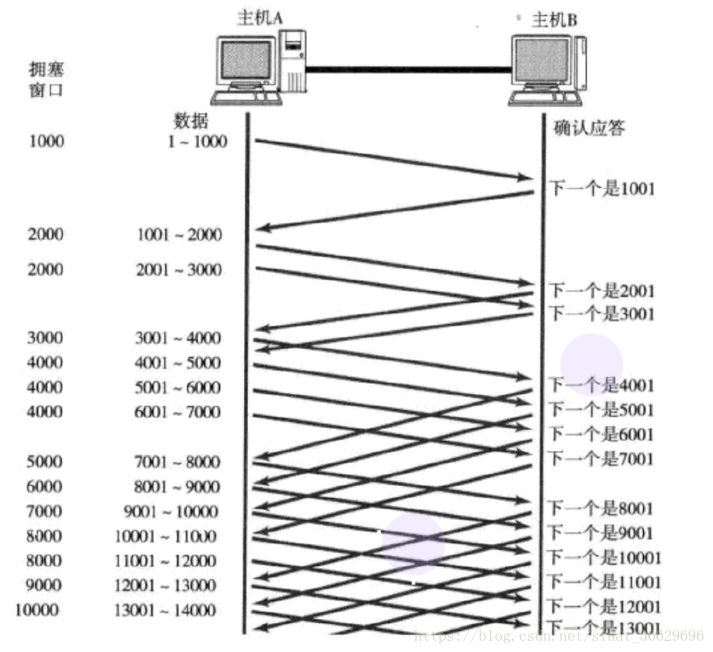

# TCP UDP

## 相关文章

-   [TCP 详解](https://blog.csdn.net/sinat_36629696/article/details/80740678)

## 三次握手，四次挥手

## TCP 校验和

-   TCP 校验和是一个端到端的校验和，由发送端计算，然后由接收端验证。其目的是为了发现 TCP 首部和数据在发送端到接收端之间发生的任何改动。如果接收方检测到校验和有差错，则 TCP 段会被直接丢弃。
-   TCP 校验和覆盖 TCP 首部和 TCP 数据，而 IP 首部中的校验和只覆盖 IP 的首部，不覆盖 IP 数据报中的任何数据。
-   TCP 的校验和是必需的，而 UDP 的校验和是可选的。
-   TCP 和 UDP 计算校验和时，都要加上一个 12 字节的伪首部

## ACK 机制

## 超时重传机制

-   主机 A 发送数据给 B 之后, 可能因为网络拥堵等原因, 数据无法到达主机 B,如果主机 A 在一个特定时间间隔内没有收到 B 发来的确认应答, 就会进行重发,但是主机 A 没收到确认应答也可能是 ACK 丢失了

### 超时时间如何确定

-   最理想的情况下, 找到一个最小的时间, 保证 “确认应答一定能在这个时间内返回”.但是这个时间的长短, 随着网络环境的不同, 是有差异的.如果超时时间设的太长, 会影响整体的重传效率; 如果超时时间设的太短, 有可能会频繁发送重复的包.
-   TCP 为了保证任何环境下都能保持较高性能的通信, 因此会动态计算这个最大超时时间.
    -   Linux 中(BSD Unix 和 Windows 也是如此), 超时以 500ms 为一个单位进行控制, 每次判定超时重发的超时时间都是 500ms 的整数倍.
    -   如果重发一次之后, 仍然得不到应答, 等待 2\*500ms 后再进行重传. 如果仍然得不到应答, 等待 4\*500ms 进行重传.

## 滑动窗口

### 窗口

-   窗口大小指的是无需等待确认应答就可以继续发送数据的最大值
-   操作系统内核为了维护这个滑动窗口, 需要开辟发送缓冲区来记录当前还有哪些数据没有应答，只有 ACK 确认应答过的数据, 才能从缓冲区删掉.
-   下图的窗口大小就是 4000 个字节 (四个段)，发送前四个段的时候, 不需要等待任何 ACK, 直接发送，收到第一个 ACK 确认应答后, 窗口向后移动, 继续发送第五六七八段的数据，因为这个窗口不断向后滑动, 所以叫做滑动窗口

### 丢包处理

-   数据包已经收到, 但确认应答 ACK 丢了，这种情况下, **部分 ACK 丢失并无大碍, 因为还可以通过后续的 ACK 来确认对方已经收到了哪些数据包**

### 滑动窗口快速重传

-   **当某一段报文丢失之后, 发送端会一直收到 1001 这样的 ACK, 就像是在提醒发送端 “我想要的是 1001”，如果发送端主机连续三次收到了同样一个 “1001” 这样的应答, 就会将对应的数据 1001 - 2000 重新发送**，这个时候接收端收到了 1001 之后, 再次返回的 ACK 就是 7001 了因为 2001 - 7000 接收端其实之前就已经收到了, 被放到了接收端操作系统内核的接收缓冲区中.

## 流量控制

-   接收端处理数据的速度是有限的. 如果发送端发的太快, 导致接收端的缓冲区被填满, 这个时候如果发送端继续发送, 就会造成丢包, 进而引起丢包重传等一系列连锁反应.**因此 TCP 支持根据接收端的处理能力, 来决定发送端的发送速度.这个机制就叫做 流量控制(Flow Control)**
-   **接收端将自己可以接收的缓冲区大小放入 TCP 首部中的 “窗口大小” 字段,通过 ACK 通知发送端**;窗口大小越大, 说明网络的吞吐量越高;接收端一旦发现自己的缓冲区快满了, 就会将窗口大小设置成一个更小的值通知给发送端;发送端接受到这个窗口大小的通知之后, 就会减慢自己的发送速度;
-   **如果接收端缓冲区满了, 就会将窗口置为 0;这时发送方不再发送数据, 但是需要定期发送一个窗口探测数据段, 让接收端把窗口大小再告诉发送端.**

## 拥塞控制

-   虽然 TCP 有了滑动窗口这个大杀器, 能够高效可靠地发送大量数据.但是如果在刚开始就发送大量的数据, 仍然可能引发一些问题.因为网络上有很多计算机, 可能当前的网络状态已经比较拥堵.在不清楚当前网络状态的情况下, 贸然发送大量数据, 很有可能雪上加霜.
-   因此, TCP 引入**慢启动机制, 先发少量的数据, 探探路, 摸清当前的网络拥堵状态以后, 再决定按照多大的速度传输数据.**

### 拥塞窗口

-   发送开始的时候, 定义拥塞窗口大小为 1;
-   每次收到一个 ACK 应答, 拥塞窗口加 1;
-   每次发送数据包的时候, 将拥塞窗口和接收端主机反馈的窗口大小做比较, 取较小的值作为实际发送的窗口
-   像上面这样的拥塞窗口增长速度, 是指数级别的.“慢启动” 只是指初使时慢, 但是增长速度非常快.为了不增长得那么快, 此处引入一个名词叫做慢启动的阈值, 当拥塞窗口的大小超过这个阈值的时候, 不再按照指数方式增长, 而是按照线性方式增长

### 拥塞控制实际效果

-   当 TCP 开始启动的时候, 慢启动阈值等于窗口最大值
-   在每次超时重发的时候, 慢启动阈值会变成原来的一半, 同时拥塞窗口置回 1
-   少量的丢包, 我们仅仅是触发超时重传;
-   大量的丢包, 我们就认为是网络拥塞;
-   当 TCP 通信开始后, 网络吞吐量会逐渐上升;
-   随着网络发生拥堵, 吞吐量会立刻下降.
-   拥塞控制, 归根结底是 TCP 协议想尽可能快的把数据传输给对方, 但是又要避免给网络造成太大压力的折中方案

## 延迟应答

-   **如果接收数据的主机立刻返回 ACK 应答, 这时候返回的窗口可能比较小**.假设接收端缓冲区为 1M. 一次收到了 500K 的数据;如果立刻应答, 返回的窗口大小就是 500K;但实际上可能处理端处理的速度很快, 10ms 之内就把 500K 数据从缓冲区消费掉了; 在这种情况下, 接收端处理还远没有达到自己的极限, 即使窗口再放大一些, 也能处理过来;**如果接收端稍微等一会儿再应答, 比如等待 200ms 再应答, 那么这个时候返回的窗口大小就是 1M**
-   窗口越大, 网络吞吐量就越大, 传输效率就越高.
-   数量限制: 每隔 N 个包就应答一次
-   时间限制: 超过最大延迟时间就应答一次
-   具体的数量 N 和最大延迟时间, 依操作系统不同也有差异，一般 N 取 2, 最大延迟时间取 200ms

## 捎带应答

-   在延迟应答的基础上, 我们发现, 很多情况下，客户端和服务器在应用层也是 “一发一收” 的，意味着客户端给服务器说了 “How are you”，服务器也会给客户端回一个 “Fine, thank you”， **那么这个时候 ACK 就可以搭顺风车, 和服务器回应的 “Fine, thank you” 一起发送给客户端**

## 总结

### 保证可靠性的机制

-   校验和
-   序列号(按序到达)
-   确认应答(ACK)
-   超时重传
-   连接管理(三次握手，四次挥手)
-   流量控制(缓冲区大小放入 TCP 首部中的 “窗口大小” 字段)
-   拥塞控制

### 提高性能的机制

-   滑动窗口
-   快速重传
-   延迟应答
-   捎带应答

### 定时器

-   超时重传定时器
-   保活定时器
-   TIME_WAIT 定时器
