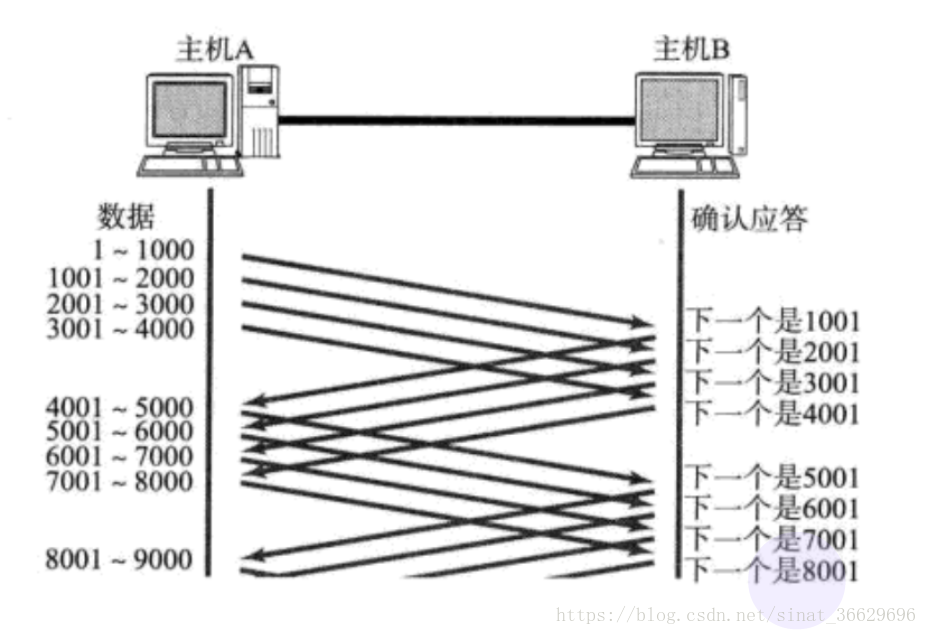

# TCP UDP

## 相关文章

- [TCP 详解](https://blog.csdn.net/sinat_36629696/article/details/80740678)

## 三次握手，四次挥手

## ACK机制

## 超时重传机制

### 超时时间如何确定

- 最理想的情况下, 找到一个最小的时间, 保证 “确认应答一定能在这个时间内返回”.但是这个时间的长短, 随着网络环境的不同, 是有差异的.如果超时时间设的太长, 会影响整体的重传效率; 如果超时时间设的太短, 有可能会频繁发送重复的包.
- TCP为了保证任何环境下都能保持较高性能的通信, 因此会动态计算这个最大超时时间.
    - Linux中(BSD Unix和Windows也是如此), 超时以500ms为一个单位进行控制, 每次判定超时重发的超时时间都是500ms的整数倍.
    - 如果重发一次之后, 仍然得不到应答, 等待 2\*500ms 后再进行重传. 如果仍然得不到应答, 等待 4\*500ms 进行重传.

## 滑动窗口

### 窗口

- 窗口大小指的是无需等待确认应答就可以继续发送数据的最大值
- 操作系统内核为了维护这个滑动窗口, 需要开辟发送缓冲区来记录当前还有哪些数据没有应答，只有ACK确认应答过的数据, 才能从缓冲区删掉.
- 下图的窗口大小就是4000个字节 (四个段)，发送前四个段的时候, 不需要等待任何ACK, 直接发送，收到第一个ACK确认应答后, 窗口向后移动, 继续发送第五六七八段的数据，因为这个窗口不断向后滑动, 所以叫做滑动窗口

### 丢包处理

- 数据包已经收到, 但确认应答ACK丢了，这种情况下, **部分ACK丢失并无大碍, 因为还可以通过后续的ACK来确认对方已经收到了哪些数据包**

### 滑动窗口快速重传

- **当某一段报文丢失之后, 发送端会一直收到 1001 这样的ACK, 就像是在提醒发送端 “我想要的是 1001”，如果发送端主机连续三次收到了同样一个 “1001” 这样的应答, 就会将对应的数据 1001 - 2000 重新发送**，这个时候接收端收到了 1001 之后, 再次返回的ACK就是7001了因为2001 - 7000接收端其实之前就已经收到了, 被放到了接收端操作系统内核的接收缓冲区中.

## 流量控制

- 接收端处理数据的速度是有限的. 如果发送端发的太快, 导致接收端的缓冲区被填满, 这个时候如果发送端继续发送, 就会造成丢包, 进而引起丢包重传等一系列连锁反应.**因此TCP支持根据接收端的处理能力, 来决定发送端的发送速度.这个机制就叫做 流量控制(Flow Control)**
- **接收端将自己可以接收的缓冲区大小放入 TCP 首部中的 “窗口大小” 字段,通过ACK通知发送端**;窗口大小越大, 说明网络的吞吐量越高;接收端一旦发现自己的缓冲区快满了, 就会将窗口大小设置成一个更小的值通知给发送端;发送端接受到这个窗口大小的通知之后, 就会减慢自己的发送速度;
- **如果接收端缓冲区满了, 就会将窗口置为0;这时发送方不再发送数据, 但是需要定期发送一个窗口探测数据段, 让接收端把窗口大小再告诉发送端.**

## 拥塞控制

- 虽然TCP有了滑动窗口这个大杀器, 能够高效可靠地发送大量数据.但是如果在刚开始就发送大量的数据, 仍然可能引发一些问题.因为网络上有很多计算机, 可能当前的网络状态已经比较拥堵.在不清楚当前网络状态的情况下, 贸然发送大量数据, 很有可能雪上加霜.
- 因此, TCP引入**慢启动机制, 先发少量的数据, 探探路, 摸清当前的网络拥堵状态以后, 再决定按照多大的速度传输数据.**

### 拥塞窗口

- 发送开始的时候, 定义拥塞窗口大小为1;
- 每次收到一个ACK应答, 拥塞窗口加1;
- 每次发送数据包的时候, 将拥塞窗口和接收端主机反馈的窗口大小做比较, 取较小的值作为实际发送的窗口
- 像上面这样的拥塞窗口增长速度, 是指数级别的.“慢启动” 只是指初使时慢, 但是增长速度非常快.为了不增长得那么快, 此处引入一个名词叫做慢启动的阈值, 当拥塞窗口的大小超过这个阈值的时候, 不再按照指数方式增长, 而是按照线性方式增长

### 拥塞控制实际效果

- 当TCP开始启动的时候, 慢启动阈值等于窗口最大值
- 在每次超时重发的时候, 慢启动阈值会变成原来的一半, 同时拥塞窗口置回1
- 少量的丢包, 我们仅仅是触发超时重传;
- 大量的丢包, 我们就认为是网络拥塞;
- 当TCP通信开始后, 网络吞吐量会逐渐上升;
- 随着网络发生拥堵, 吞吐量会立刻下降.
- 拥塞控制, 归根结底是TCP协议想尽可能快的把数据传输给对方, 但是又要避免给网络造成太大压力的折中方案

## 延迟应答

- **如果接收数据的主机立刻返回ACK应答, 这时候返回的窗口可能比较小**.假设接收端缓冲区为1M. 一次收到了500K的数据;如果立刻应答, 返回的窗口大小就是500K;但实际上可能处理端处理的速度很快, 10ms之内就把500K数据从缓冲区消费掉了; 在这种情况下, 接收端处理还远没有达到自己的极限, 即使窗口再放大一些, 也能处理过来;**如果接收端稍微等一会儿再应答, 比如等待200ms再应答, 那么这个时候返回的窗口大小就是1M**
- 窗口越大, 网络吞吐量就越大, 传输效率就越高.
- 数量限制: 每隔N个包就应答一次
- 时间限制: 超过最大延迟时间就应答一次
- 具体的数量N和最大延迟时间, 依操作系统不同也有差异，一般 N 取2, 最大延迟时间取200ms

## 捎带应答

- 在延迟应答的基础上, 我们发现, 很多情况下，客户端和服务器在应用层也是 “一发一收” 的，意味着客户端给服务器说了 “How are you”，服务器也会给客户端回一个 “Fine, thank you”， **那么这个时候ACK就可以搭顺风车, 和服务器回应的 “Fine, thank you” 一起发送给客户端**
