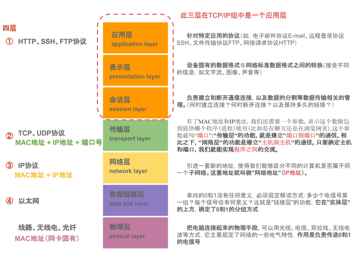
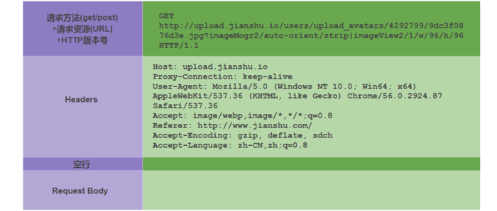
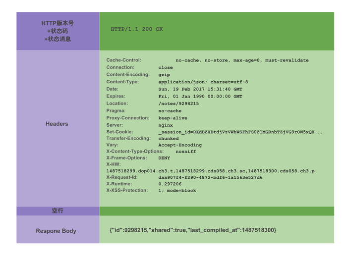

# Http

## 网络层次划分

- [计算机网络协议层次](https://blog.csdn.net/gavin_john/article/details/53186570)
- 

### 应用层

- 应用层是网络应用程序以及它们的应用层协议存留的地方。因特网应用层包括许多协议，例如HTTP（Web应用的主要协议）、SMTP（邮件传输）和FTP（文件传送）等。再比如我们每天都在使用的DNS域名系统。
- 应用层协议分布在多个端系统上，一个端系统中的应用程序使用协议与另外一个端系统中的应用程序交换信息的分组。
- 我们把位于应用层的信息分组称为报文。

### 传输层

- 因特网的传输层在应用程序端点之间传送应用层报文。**在因特网中，有TCP和UDP两个传输层协议。**
- **TCP向它的应用程序提供了面向连接的服务**，这种服务包括了应用层报文向目的地的确保传递和流量控制。TCP也将长报文划分成短报文，并提供拥塞控制机制，因此，当网络拥塞时，发送方可以抑制其传输速率。
- **UDP协议向它的应用程序提供无连接服务**。这是一种不提供不必要服务的服务，没有可靠性，没有流量控制，也没有拥塞控制。
- 我们把传输层分组称为报文段。

### 网络层

- 因特网的网络层负责将称为数据报的网络层分组从一台主机移动到另一台主机。**在一台源主机中的因特网传输层协议(TCP或者UDP)向网络层递交传输层报文段和目的地址。**
- **网络层包括著名的IP协议**，该协议定义了在数据报中的各个字段以及端系统和路由器如果作用于这些字段。
- **网络层也包括决定路由的路由选择协议，它使得数据报根据该路由从源传输到目的地。**

### 链路层

- 网络层通过源和目的地之间的一系列路由器路由数据报，为了将分组从一个结点移动到路径的下一个结点，网络层必须依靠链路层的服务。特别是在每个结点，网络层将数据报下传给链路层，链路层沿着路径将数据报传递给下一个结点，在下一个结点，链路层将数据报上传给网络层。
- 由链路层提供的服务取决于应用于该链路的特定的链路层协议，**比如我们常见的以太网，WIFI等。**
- 因为数据报从源到目的地传送通常要经过几条链路，一个数据报可能被沿途不同链路上的不同链路层协议处理。例如，一个数据报可能被一段链路上的以太网和下一段链路上的PPP所处理。网络层将受到来自每个不同链路的链路层协议的服务。
- 我们把链路层分组称为帧。

### 物理层

- **链路层的任务是将整个帧从一个网络元素移动到邻近的网络元素，而物理层的任务是将该帧中的一个一个比特从一个结点移动到下一个结点**。
- 物理层的协议是和链路相关的，并且进一步与该链路的实际传输媒体相关。比如，以太网具有许多物理层协议：一个是关于双绞铜线的，另一个是关于同轴电缆的，还有是关于光纤的等等。

## 报文的封装

- 

## Socket

- **Socket对TCP/IP协议的封装是跨传输层和应用层的**
- **Socket是对TCP/IP协议的封装，他本身不是什么协议，而是一个调用接口（API）**
- TCP/IP只是一个协议栈，必须要具体实现，同时还要提供对外的操作接口，这就是Socket接口

## 参考资料

- [HTTP协议详解与Android相关基础网络编程](https://www.jianshu.com/p/3ea1bf1ba915)
- [HTTP请求行、请求头、请求体详解](https://blog.csdn.net/u010256388/article/details/68491509)

## Http请求报文格式

- 
- 

## Http Header

- [List of HTTP header fields](https://en.wikipedia.org/wiki/List_of_HTTP_header_fields)

### Accept

- 请求报文可通过一个“Accept”报文头属性告诉服务端 客户端接受什么类型的响应

```java
Accept:text/plain
```

- [mineType](https://en.wikipedia.org/wiki/Media_type)

### Referer

- Referer是header的一部分，**当浏览器向web服务器发送请求的时候，一般会带上Referer，告诉服务器我是从哪个页面链接过来的，服务器藉此可以获得一些信息用于处理**。比如从我主页上链接到一个朋友那里，他的服务器就能够从HTTP Referer中统计出每天有多少用户点击我主页上的链接访问他的网站

### Cache-Control

- Cache-Control指定请求和响应遵循的缓存机制。
- 缓存指令是单向的，即请求中存在一个指令并不意味着响应中将存在同一个指令
- 请求时的缓存指令包括no-cache、no-store、max-age、max-stale、min-fresh、only-if-cached。
- 响应消息中的指令包括public、private、no-cache、no-store、no-transform、must-revalidate、proxy-revalidate、max-age。

Cache-directive                      | 说明
-------------------------------------|-------------------------------------------------------------------------------------------------------------------------------------------------------------------------------------------------
public                               | 所有内容都将被缓存(客户端和代理服务器都可缓存)
private                              | 内容只缓存到私有缓存中(仅客户端可以缓存，代理服务器不可缓存)
no-cache                             | 必须先与服务器确认返回的响应是否被更改，然后才能使用该响应来满足后续对同一个网址的请求。因此，如果存在合适的验证令牌 (ETag)，no-cache 会发起往返通信来验证缓存的响应，如果资源未被更改，可以避免下载。
no-store                             | 所有内容都不会被缓存到缓存或 Internet 临时文件中
must-revalidation/proxy-revalidation | 如果缓存的内容失效，请求必须发送到服务器/代理以进行重新验证
max-age=xxx (xxx is numeric)         | 缓存的内容将在 xxx 秒后失效, 这个选项只在HTTP 1.1可用, 并如果和Last-Modified一起使用时, 优先级较高

## Http响应报文格式

- 

### 状态码

状态码 | 说明
-------|-------------------------------------------
1XX    | 提示信息 - 表示请求已被成功接收，继续处理
2XX    | 成功 - 表示请求已被成功接收，理解，接受
3XX    | 重定向 - 要完成请求必须进行更进一步的处理
4XX    | 客户端错误 - 请求有语法错误或请求无法实现
5XX    | 服务器端错误 - 服务器未能实现合法的请求

- **200 OK**，你最希望看到的，即处理成功！
- **303 See Other**，我把你redirect到其它的页面，目标的URL通过响应报文头的Location告诉你。
- **304 Not Modified**， 告诉客户端，你请求的这个资源至你上次取得后，并没有更改，你直接用你本地的缓存吧
- **404 Not Found**， 你最不希望看到的，即找不到页面。如你在google上找到一个页面，点击这个链接返回404，表示这个页面已经被网站删除了，google那边的记录只是美好的回忆
- **500 Internal Server Error**，看到这个错误，你就应该查查服务端的日志了，肯定抛出了一堆异常

