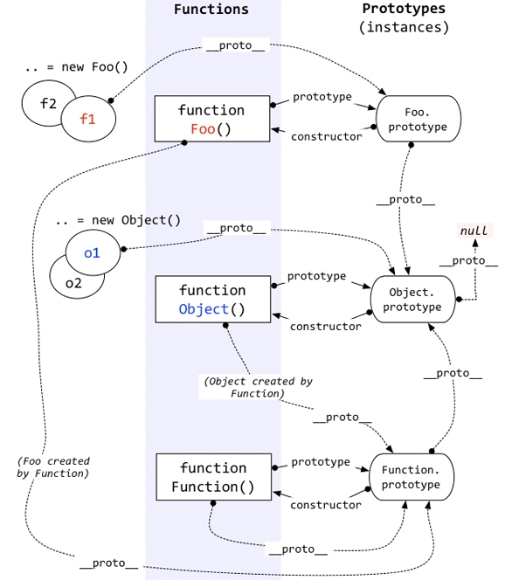

# Prototype与_proto_

- [JS中原型链中的prototype与_proto_的个人理解与详细总结](https://www.cnblogs.com/libin-1/p/6014925.html)
- [详解prototype与__proto__区别](https://blog.csdn.net/ligang2585116/article/details/53522741)

## 总结

- 

- **每个对象都具有一个名为__proto__的属性**，但是它是一个内部属性，所以一般用Object.setPrototypeOf()（写操作）、Object.getPrototypeOf()（读操作）、Object.create()（生成操作）代替
- **每个构造函数都具有一个名为prototype的对象属性**，注意：既然是对象属性，**所以prototype同样带有__proto__属性**
- **每个对象的__proto__属性指向自身构造函数的prototype**
- 由同一个构造函数构造的对象，共享相同的__proto__,也就是其构造函数的prototype

```js
    // 构造函数
    function Fun() {
    }

    // 对象
    var fn = new Fun();

    // 对象的__proto__=其构造函数的prototype
    log(Object.getPrototypeOf(fn) === Fun.prototype);                   // true

    // Fun是函数，所以其__proto__为其构造函数Function()的prototype,当然也不是Fun.prototype
    log(Object.getPrototypeOf(Fun) === Fun.prototype);                  // false
    log(Object.getPrototypeOf(Fun) === Function.prototype);             // true

    // Function是一个函数，函数的原型为构造函数Function()的原型
    log(Object.getPrototypeOf(Function) === Object.prototype);          // false
    log(Object.getPrototypeOf(Function) === Function.prototype);        // true


    // Fun.prototype也是一个对象，其原型应当是Object.prototype
    log(Object.getPrototypeOf(Fun.prototype) === Function.prototype);   // false
    log(Object.getPrototypeOf(Fun.prototype) === Object.prototype);     // true
    // Function.prototype 是一个对象，其原型是其构造函数Object()的prototype
    // 所有构造函数的prototype的__proto__都指向了Object.prototype
    // 除了Object.__proto__指向的是Function.prototype
    log(Object.getPrototypeOf(Function.prototype) === Object.prototype); //true
    log(Object.getPrototypeOf(Object) === Function.prototype);           // true
    log(Object.getPrototypeOf(Object.prototype) == null)                 // true
```

- 总结：
    - prototype是构造函数独有的属性
    - 对象的__proto__属性通常与其构造函数的prototype属性相互对应
    - 除了Object.prototype的__proto__指向null, 其它所有构造函数的的prototype方法的__proto__指向Object.prototype；
    - Function的__proto__指向其构造函数Function()的prototype,也就是Function.prototype
    - Object作为一个构造函数(是一个函数对象!!函数对象!!),所以他的__proto__指向Function.prototype；
    - Function.prototype的__proto__指向其构造函数Object的prototype
    - Object.prototype的__prototype__指向null（尽头）；

## 其它相关方法

### hasOwnProperty

- hasOwnProperty(v: string): boolean; 判断指定属性是否为自有属性
- 如果该属性或者方法是该对象自身定义的而不是原型链中定义的 则返回true;否则返回false;

```js
```

### isPrototypeOf

- isPrototypeOf是用来判断指定对象object1是否存在于另一个对象object2的原型链中，是则返回true，否则返回false。
- 原型链可以用来在同一个对象类型的不同实例之间共享功能。如果 object2 的原型链中包含object1，那么 isPrototypeOf 方法返回 true。如果 object2 不是一个对象或者 object1 没有出现在 object2 中的原型链中，isPrototypeOf 方法将返回 false。

## 示例

```js
function People() {
    var age = 1;
    this.age = 10;
}

People.age = 20;
People.prototype.age = 30;

var age = 1：age为局部变量；
this.age = 10：函数调用时，age为this指向对象的属性；
People.age = 20：构造函数的age变为20；
People.prototype.age = 30：原型添加age属性；
```