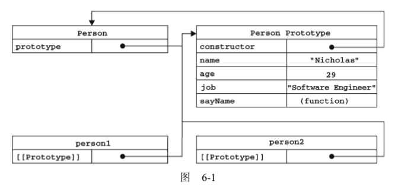

# 面向对象

## 属性类型

- **[[Configurable]]**:表示能否通过 delete 删除属性从而重新定义属性，能否修改属性的特性，或者能否把属性修改为访问器属性。像前面例子中那样直接在对象上定义的属性，它们的这个特性默认值为 true。
- **[[Enumerable]]**:表示能否通过 for-in 循环返回属性。像前面例子中那样直接在对象上定义的属性，它们的这个特性默认值为 true
- **[[Writable]]**:表示能否修改属性的值。像前面例子中那样直接在对象上定义的属性，它们的这个特性默认值为true
- **[[Value]]**:包含这个属性的数据值。读取属性值的时候，从这个位置读;写入属性值的时候，把新值保存在这个位置。这个特性的默认值为 undefined
- 要修改属性默认的特性，必须使用 ECMAScript 5 的 Object.defineProperty()方法
    - configurable
    - enumerable
    - writable
    - value

```typescript
// ts
interface PropertyDescriptor {
    configurable?: boolean;
    enumerable?: boolean;
    value?: any;
    writable?: boolean;
    get?(): any;
    set?(v: any): void;
}

var person = {};
Object.defineProperty(person, "name", {
    writable: false,
    value: "Nicholas"
});
alert(person.name); //"Nicholas"
person.name = "Greg";
alert(person.name); //"Nicholas"
```

- **一旦把属性定义为不可配置的， 就不能再把它变回可配置了**。此时，再调用 Object.defineProperty()方法修改除 writable 之外 的特性，都会导致错误
- 可以多次调用 Object.defineProperty()方法修改同一个属性，但在把 configurable 特性设置为 false 之后就会有限制了
- 在调用 Object.defineProperty()方法时，**如果不指定，configurable、enumerable 和 writable 特性的默认值都是 false**

```js
var person = {};
Object.defineProperty(person, "name", {
    configurable: false,
    value: "Nicholas"
});

//抛出错误
Object.defineProperty(person, "name", {
    configurable: true,
    value: "Nicholas"
});
```

### 访问器属性

- 访问器属性不包含数据值;它们包含一对儿 getter 和 setter 函数(不过，这两个函数都不是必需的)
- 在读取访问器属性时，会调用getter函数，这个函数负责返回有效的值;
- 在写入访问器属性时，会调用 setter 函数并传入新值，这个函数负责决定如何处理数据
    - [[Configurable]]:表示能否通过 delete 删除属性从而重新定义属性，能否修改属性的特性，或者能否把属性修改为数据属性。对于直接在对象上定义的属性，这个特性的默认值为 true。
    - [[Enumerable]]:表示能否通过 for-in 循环返回属性。对于直接在对象上定义的属性，这个特性的默认值为 true
    - [[Get]]:在读取属性时调用的函数。默认值为 undefined
    - [[Set]]:在写入属性时调用的函数。默认值为 undefined
- 访问器属性不能直接定义，必须使用 Object.defineProperty()来定义
- **下划线开头的属性，前面的下划线是一种常用的记号，用于表示只能通过对象方法访问的属性**
- 不一定要同时指定setter与getter

```js
var book = {
    // _year 前面 的下划线是一种常用的记号，用于表示只能通过对象方法访问的属性
    _year: 2004,
    edition: 1
};

Object.defineProperty(book, "year", {
    get: function(){
        return this._year;
    },
    set: function(newValue){
        if (newValue > 2004) {
            this._year = newValue;
            this.edition += newValue - 2004;
        }
    }
});

// 虽然没有直接的year属性，但是可以get/set设置读取属性
book.year = 2005;
alert(book.edition); //2
```

### 定义多个属性

- Object.defineProperties()

```js
    var book = {};
    Object.defineProperties(book, {
        _year: {
            value: 2004
        },
        edition: {
            value: 1
        },
        year: {
            get: function () {
                return this._year;
            },
            set: function (newValue) {
                if (newValue > 2004) {
                    this._year = newValue;
                    this.edition += newValue - 2004;
                }
            }
        }
    });
```

### 读取属性的特性

- 使用 ECMAScript 5 的 Object.getOwnPropertyDescriptor()方法，可以取得给定属性的描述符

```js
var descriptor = Object.getOwnPropertyDescriptor(book, "_year");
alert(descriptor.value); //2004
alert(descriptor.configurable); //false

alert(typeof descriptor.get); //"undefined"
var descriptor = Object.getOwnPropertyDescriptor(book, "year");
alert(descriptor.value); //undefined
alert(descriptor.enumerable); //false
alert(typeof descriptor.get); //"function"
```

## 创建对象

### 工厂模式

- 可以创建相似的对象，但无法判别类型

```js
function createPerson(name, age, job){
    var o = new Object();
    o.name = name;
    o.age = age;
    o.job = job;
    o.sayName = function(){
        alert(this.name);
    };
    return o;
}

var person1 = createPerson("Nicholas", 29, "Software Engineer");
var person2 = createPerson("Greg", 27, "Doctor");
```

### 构造函数模式

- 没有显式地创建对象
- 直接将属性和方法赋给了 this 对象
- 没有 return 语句
- 构造函数首字母大写
- **问题在于，就是每个方法都要在每个实例上重新创建一遍**

```js
function Person(name, age, job){
    this.name = name;
    this.age = age;
    this.job = job;
    this.sayName = function(){
        alert(this.name);
    };
    // 没有return语句
}

var person1 = new Person("Nicholas", 29, "Software Engineer");
var person2 = new Person("Greg", 27, "Doctor");
```

```js
// 当作构造函数使用
var person = new Person("Nicholas", 29, "Software Engineer");
person.sayName(); //"Nicholas"

// 作为普通函数调用
// 全局作用域调用函数，指向Global对象，也就是window对象
Person("Greg", 27, "Doctor"); // 添加到window
window.sayName(); //"Greg"

// 在另一个对象的作用域中调用
var o = new Object();
Person.call(o, "Kristen", 25, "Nurse");
o.sayName(); //"Kristen"
```

```js
function Person(name, age, job){
    this.name = name;
    this.age = age;
    this.job = job;
    this.sayName = new Function("alert(this.name)"); // 与声明函数在逻辑上是等价的
}

var person1 = createPerson("Nicholas", 29, "Software Engineer");
var person2 = createPerson("Greg", 27, "Doctor");

// 两个不同对象上的sayName实际不是同一个对象
alert(person1.sayName == person2.sayName);  //false
```

```js
function Person(name, age, job){
    this.name = name;
    this.age = age;
    this.job = job;
    this.sayName = sayName;
}
function sayName(){
    alert(this.name);
}

// 现在两个对象的sayName是同一个对象
var person1 = new Person("Nicholas", 29, "Software Engineer");
var person2 = new Person("Greg", 27, "Doctor");
```

### 原型模式

- [JS中原型链中的prototype与_proto_的个人理解与详细总结](https://www.cnblogs.com/libin-1/p/6014925.html)
- [详解prototype与__proto__区别](https://blog.csdn.net/ligang2585116/article/details/53522741)

#### 理解原型对象

- 无论什么时候，**只要创建了一个新函数，就会根据一组特定的规则为该函数创建一个prototype属性**，这个属性指向函数的原型对象
- 所有原型对象都会自动获得一个constructor属性，这个属性包含一个指向prototype属性所在函数的指针

```js
function Person() {
}

// 函数的prototype属性
// 函数的prototype的constructor指向函数本身
console.log(Person.prototype.constructor === Person);  // true
```



- 当调用构造函数创建一个新实例后，该实例的内部将包含一个指针(内部属性)，指向构造函数的原型对象,ECMA-262第5版中管这个指针叫[[Prototype]],在具体的实现上,一般这个指针被命名为__proto__，为了兼容一般用Object.setPrototypeOf()（写操作）、Object.getPrototypeOf()（读操作）、Object.create()（生成操作）代替操作这个__proto__属性
- **每个构造函数都具有一个名为prototype的对象属性**，既然是对象属性，**所以prototype同样带有__proto__属性**
- **每个对象的__proto__属性指向自身构造函数的prototype**
- 由同一个构造函数构造的对象，共享相同的__proto__,也就是其构造函数的prototype


```js
    // 构造函数
    function Fun() {
    }

    // 对象
    var fn = new Fun();

    // 对象的__proto__=其构造函数的prototype
    log(Object.getPrototypeOf(fn) === Fun.prototype);                   // true

    // Fun是函数，所以其__proto__为其构造函数Function()的prototype,当然也不是Fun.prototype
    log(Object.getPrototypeOf(Fun) === Fun.prototype);                  // false
    log(Object.getPrototypeOf(Fun) === Function.prototype);             // true

    // Function是一个函数，函数的原型为构造函数Function()的原型
    log(Object.getPrototypeOf(Function) === Object.prototype);          // false
    log(Object.getPrototypeOf(Function) === Function.prototype);        // true


    // Fun.prototype也是一个对象，其原型应当是Object.prototype
    log(Object.getPrototypeOf(Fun.prototype) === Function.prototype);   // false
    log(Object.getPrototypeOf(Fun.prototype) === Object.prototype);     // true
    // Function.prototype 是一个对象，其原型是其构造函数Object()的prototype
    // 所有构造函数的prototype的__proto__都指向了Object.prototype
    // 除了Object.__proto__指向的是Function.prototype
    log(Object.getPrototypeOf(Function.prototype) === Object.prototype); //true
    log(Object.getPrototypeOf(Object) === Function.prototype);           // true
    log(Object.getPrototypeOf(Object.prototype) == null)                 // true
```

- 总结：
    - prototype是函数独有的属性
    - 对象的__proto__属性通常与其构造函数的prototype属性相互对应
    - 除了Object.prototype的__proto__指向null, 其它所有构造函数的的prototype方法的__proto__指向Object.prototype；
    - Function的__proto__指向其构造函数Function()的prototype,也就是Function.prototype
    - Object作为一个构造函数(是一个函数对象!!函数对象!!),所以他的__proto__指向Function.prototype；
    - Function.prototype的__proto__指向其构造函数Object的prototype
    - Object.prototype的__proto__指向null；

- **isPrototypeOf**
    - isPrototypeOf是用来判断指定对象object1是否存在于另一个对象object2的原型链中，是则返回true，否则返回false。
    - 如果[[Prototype]]指向调用 isPrototypeOf()方法的对象 (Person.prototype)，那么这个方法就返回 true

```js
function Person() {
}

var p1 = new Person();
console.log(Person.prototype.isPrototypeOf(p1));
```

#### 属性的查找

- 每当代码读取某个对象的某个属性时，都会执行一次搜索，目标是具有给定名字的属性。
    - **搜索首先从对象实例本身开始**。如果在实例中找到了具有给定名字的属性，则返回该属性的值;
    - **如果没有找到，则继续搜索指针指向的原型对象，在原型对象中查找具有给定名字的属性**
- **虽然可以通过对象实例访问保存在原型中的值，但却不能通过对象实例重写原型中的值**
- **如果我们在实例中添加了一个属性，而该属性与实例原型中的一个属性同名，那我们就在实例中创建该属性，该属性将会屏蔽原型中的那个属性**
- **当为对象实例添加一个属性时，这个属性就会屏蔽原型对象中保存的同名属性**;换句话说，添加这个属性只会阻止我们访问原型中的那个属性，但不会修改那个属性。即使将这个属性设置为 null，也只会在实例中设置这个属性，而不会恢复其指向原型的连接。**使用delete 操作符则可以完全删除实例属性，从而让我们能够重新访问原型中的属性**

```js
function Person(){
}

Person.prototype.name = "Nicholas";
Person.prototype.age = 29;
Person.prototype.job = "Software Engineer";
Person.prototype.sayName = function(){
    alert(this.name);
};

var person1 = new Person();
var person2 = new Person();

person1.name = "Greg";
alert(person1.name); //"Greg"——来自实例
alert(person2.name); //"Nicholas"——来自原型

// delete删除实例属性
delete person1.name;
alert(person1.name); //"Nicholas"——来自原型
```

- hasOwnProperty(),可以检测一个属性是存在于实例中，还是存在于原型中。这个方法(不要忘了它是从Object继承来的)只在给定属性存在于对象实例中时，才会返回true

```js
function Person(){
    }
    Person.prototype.name = "Nicholas";
    Person.prototype.age = 29;
    Person.prototype.job = "Software Engineer";
    Person.prototype.sayName = function(){
        alert(this.name);
    };

        var person1 = new Person();
var person2 = new Person();
alert(person1.hasOwnProperty("name"));  //false
person1.name = "Greg";
alert(person1.name); //"Greg"——来自实例 alert(person1.hasOwnProperty("name")); //true
alert(person2.name); //"Nicholas"——来自原型 alert(person2.hasOwnProperty("name")); //false
delete person1.name;
alert(person1.name); //"Nicholas"——来自原型 alert(person1.hasOwnProperty("name")); //false
```

## 示例

```js
function People() {
    var age = 1;
    this.age = 10;
}

People.age = 20;
People.prototype.age = 30;

var age = 1：age为局部变量；
this.age = 10：函数调用时，age为this指向对象的属性；
People.age = 20：构造函数的age变为20；
People.prototype.age = 30：原型添加age属性；
```